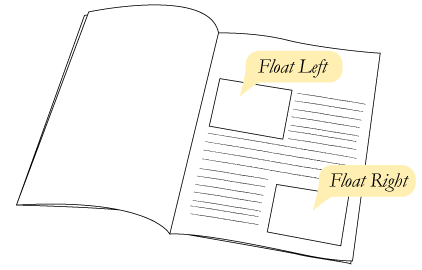
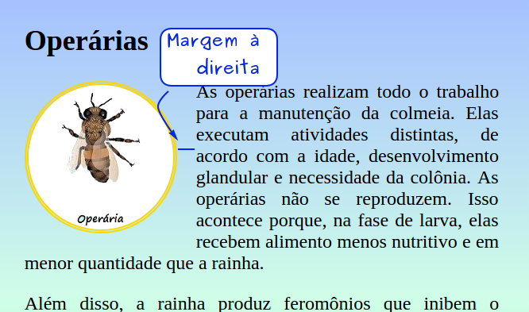
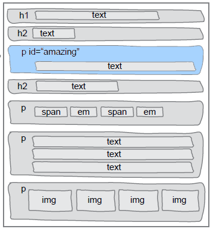
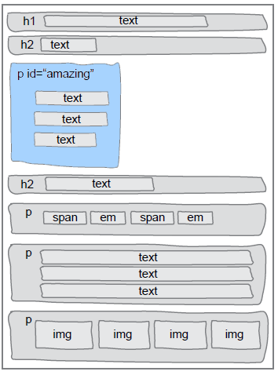
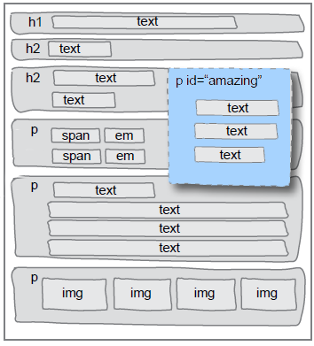
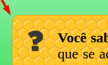

<!-- {"layout": "section-header", "hash": "abelhas-e-suas-castas"} -->
# Abelhas e suas castas
## Abelhas

- A atividade das abelhas
- Flutuando coisas
- Pesquisando novas propriedades CSS/elementos HTML
<!-- {ul:.content} -->

---
<!-- {"backdrop": "pratica-abelhas"} -->

---
# Abelhas e suas castas

1. [Baixe as imagens e páginas](https://github.com/fegemo/cefet-front-end-bees/archive/master.zip)
   que serão usados
   1. Descompacte o arquivo `cefet-front-end-bees-master.zip` na área de trabalho
      - Isto criará uma pasta com o nome `cefet-front-end-bees-master` lá
   1. **Renomeie** a pasta criada na área de trabalho para `site-abelhas`
      - Esta é a **pasta raiz** do site - onde devem ficar os arquivos `.html`
   1. Veja [instruções detalhadas aqui](https://github.com/fegemo/cefet-front-end-bees/blob/master/README.md)

---
<!-- {"hash": "flutuando-coisas"} -->
# Flutuando coisas

>  <!-- {.push-right style="height: 200px;"} -->
  **Jornais e revistas** costumam colocar **imagens junto ao texto** para
  fazer uma bela diagramação do conteúdo
> <cite>Coutinho, 2017</cite>
> Isso se chama **deixar o elemento** (_e.g._, imagem) **flutuando**
> <cite>Hasan, 2017</cite>

- Na web também queremos fazer isso!

---
<!-- {"layout": "centered-horizontal"} -->
## Como flutuar elementos usando CSS?



Vamos conhecer um nova propriedade: `float`

---
## Propriedade `float`

- Usado para alterar o fluxo tradicional da página
  - Em CSS:  
    ```css
    img#abelha-operaria {
      float: left; /* left, right, none */
    }              /* none é o valor padrão - sem flutuação */
    ```
  - No HTML:
    ```html
    
    <p>Texto ...</p>
    ```

---
## Como funciona o `float`

 <!-- {.push-right} -->

- Um elemento flutuante é removido do fluxo tradicional e
  - os elementos `block` depois dele fingem que ele não está ali
  - os elementos `inline` depois dele respeitam seu formato
- Vamos fazer com que o parágrafo com `id="amazing"`
  flutue à direita **nos próximos 2 slides**...

---
## Exemplo de `float` (1º passo)

  <!-- {.push-right style="max-height: 440px;"} -->
- Alterando a largura de um parágrafo para 200px
  ```css
  p#amazing {
    width: 200px;
  }
  ```

---
## Exemplo de `float` (2º passo)

  <!-- {.push-right style="max-height: 350px;"} -->
- Flutuando o parágrafo à direita
  ```css
  p#amazing {
    width: 200px;
    float: right;
  }
  ```
  - Repare que:
    - Elementos declarados <u>antes</u> do parágrafo flutuante
      **não são alterados**
    - Elementos declarados <u>depois</u>:
      - Se forem `block`, **ignoram** o elemento flutuante
      - Se forem `inline`, **respeitam** o elemtno flutuante

---
<!-- {"hash": "arredondando-bordas"} -->
## Arredondando bordas

 <!-- {.push-right} -->
- Como arredondar bordas?
  - Há muitas propriedades CSS que não teremos tempo de ver no curso
  - Contudo, a Web é uma ótima fonte de informação
  - Pesquise ["como arredondar bordas em CSS" no Google][border-radius-google],
    por exemplo

[border-radius-google]: https://www.google.com.br/search?hl=pt-BR&q=como+arredondar+bordas+em+css&meta=

---