<!-- {"layout": "title"} -->
# **CSS** parte 3
## Fontes, Multimídia

---
## Dica para prova - erros comuns (1/4)
### Endereço absoluto vs relativo

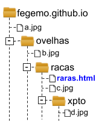 <!-- {ul:.layout-split-2 style="list-style-type: none; justify-content: space-between;"} -->

  | Endereço Absoluto          	| End. Relativo 	|
  |---------------------------	|---------------	|
  | /ovelhas/racas/c.jpg      	| `c.jpg`        	|
  | /ovelhas/racas/xpto/d.jpg 	| `xpto/d.jpg`   	|
  | /ovelhas/b.jpg            	| `../b.jpg`     	|
  | /a.jpg                    	| `../../a.jpg`  	|

---
## Dica para prova - erros comuns (2/4)

- Escreva uma (única) regra em CSS para colorir de vermelho apenas links
  que estejam dentro de tabelas. Os demais links não devem ser alterados.

1. Correto ✅:
   ```css
   table a {
     color: red;
   }
   ```
1. Errado:
   ```css
   td a {
     color: red;
   }
   ```
1. Errado:
   ```css
   .links {
      color: red;
   }
   ```
1. Errado: <!-- {ol:.layout-split-4 style="justify-content: space-between; padding-left: 0; list-style-type: none"} -->
   ```css
   a[td href$=" "] {
     color: red;
   }
   ```

---
## Dica para prova - erros comuns (3/4)

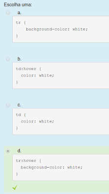 <!-- {.push-right} -->

- **Regra CSS** para fazer com que uma **linha** da tabela mude sua **cor de fundo** quando o **mouse passar em cima dela** ([jsFiddle][jsFiddle]).


[jsFiddle]: https://jsfiddle.net/fuajp1sn/


---
## Dica para prova - erros comuns (4/4)

- Lista de item dentro de um parágrafo
  - O parágrafo deve possuir apenas elementos _inline_
- Item de lista definido sem sua respectiva lista
- Tags abertas e não fechadas:
  - Sempre que abrir uma `tag`, feche-a
  - Indente o código
  - Lembrem-se de usar mais recursos do editor/navegador:
    - Ao criar um arquivo `.html`, na primeira linha, digite `html` e depois <kbd>tab</kbd>, ou
      - Pressione <kbd>!</kbd> e em seguida pressione a tecla <kbd>tab</kbd>

---
<!-- {"layout": "2-column-content-zigzag"} -->
# Na última aula... (1/4)

- Vimos que existem os elementos `<div>...</div>` e `<span>...</span>` que
  não possuem interpretação visual, mas **servem para agruparmos e
  estilizarmos** outros elementos ou texto

  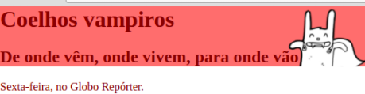 <!-- {.bordered} -->

```html
<body>
  <div id="topo-da-pagina">  
    <h1>Coelhos Vampiros</h1>
    <h2>De onde vêm, onde vivem ...</h2>
  </div>
  <p>Sexta-feira, no Globo Repórter</p>
</body>
```


---
# Na última aula... (2/4)

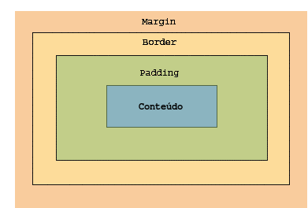 <!-- {.push-right} -->
- Entendemos o _Box Model_ (modelo da caixa) que é **como o navegador enxerga
  os elementos**
  - Há espaço para _conteúdo_ <!-- {.box-model-part style="background: #8bb4c0;"} -->,
    _`padding`_ <!-- {em:.box-model-part style="background: #c2ce89;"} -->,
    _`border`_ <!-- {em:.box-model-part style="background: #fddc9a;"} --> e
    _`margin`_ <!-- {em:.box-model-part style="background: #f9cc9d;"} -->

---
# Na última aula... (3/4)

- Quando se define `width` ou `height` para um elemento, reserva-se
  aquele espaço para o _conteúdo_ <!-- {.box-model-part style="background: #8bb4c0;"} -->
  - O tamanho total do elemento pode ficar maior que isso
- Podemos alterar isso, dizendo que o valor definido para `width` ou `height`
  deve caber _conteúdo_ <!-- {.box-model-part style="background: #8bb4c0;"} --> +
  _`padding`_ <!-- {em:.box-model-part style="background: #c2ce89;"} --> +
  _`border`_ <!-- {em:.box-model-part style="background: #fddc9a;"} -->:
  ```css
  .produto {
    width: 50px;
    box-sizing: border-box; /* o padrão é content-box */
  }
  ```


---
# Na última aula... (4/4)

- É possível que um elemento interrompa uma flutuação à esquerda (`left`),
  à direita (`right`) ou em ambos os lados (`both`) usando `clear`

  <iframe width="90%" height="460" src="//jsfiddle.net/fegemo/vxb79m2c/embedded/result,html,css/dark/" allowfullscreen="allowfullscreen" frameborder="1"></iframe>

  - A **propriedade `clear`** pode ser:
    - `left` ou `right`: interrompe apenas as flutuações à esquerda ou à direita
    - `both`: interrompe **ambos** lados
    - `none`: **não interrompe** (valor padrão)

---
<!-- {"layout": "centered"} -->
# Hoje veremos

1. [Formatos de imagens](#formatos-de-imagens)
1. [Vídeo e Áudio](#video-e-audio)
1. [Web fonts](#web-fonts)

---
<!-- {"layout": "section-header", "hash": "formatos-de-imagens"} -->
# Formatos de imagens
## Usando diferentes formatos

- JPEG
- GIF
- PNG
- SVG
<!-- {ul:.content} -->

---
## Imagens

- Usamos a tag ``, que é um **elemento _void_**
  - Ou seja, não tem conteúdo nem tag de fechamento
- Formato geral
  ```html
  
  ```
  - [Referência na Mozilla Developer Network][mdn-img]
- Mas que **formatos** <!-- {.underline.upon-activation} --> de imagens existem?

[mdn-img]: https://developer.mozilla.org/en-US/docs/Web/HTML/Element/img

---
## Imagens: **formato**

- Existem vários formatos de imagens suportados por navegadores: <!-- {.bullet} -->

**JPEG** (ou JPG) <!-- {strong:.alternate-color} -->  <!-- {dl:.bulleted} -->
- bom para **fotos** tiradas do mundo real, que possuem muita variação de cor. Não possui
  transparência

**GIF** <!-- {strong:.alternate-color} -->
- **transparência** de 1 bit e suporta **animações** de quadros
- apenas 256 cores na imagem (muito pouco!!)

**PNG** <!-- {strong:.alternate-color} -->
- **transparência** de 8 bits e suporta **mais cores** que GIF
- bom formato para imagens com pouca variação de cor

**SVG** <!-- {strong:.alternate-color} -->
- imagens **vetoriais** que não perdem qualidade se **ampliadas**

*[JPEG]: Joint Photographic Experts Group*
*[GIF]: Graphics Interchange Format*
*[PNG]: Portable Network Graphics*
*[SVG]: Scalable Vector Graphics*

---
<!-- {"layout": "2-column-content-zigzag"} -->
## Transparências: PNG _vs_ GIF

**GIF**: Um pixel é totalmente transparente ou totalmente opaco

 <!-- {p:.center-aligned} -->
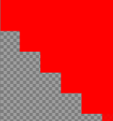

**PNG**: Opacidade pode variar entre 0 (transparente) e 255 (opaco), ou
0% e 100%

 <!-- {p:.center-aligned} -->
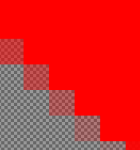

---
<!-- {"layout": "2-column-content-zigzag"} -->
## Imagens **vetoriais** (_e.g._, SVG)

Imagem _bitmap_ (JPG, GIF, PNG) original (pequena) e aumentada
(fica "**estourada**")

 <!-- {p:.center-aligned} -->
<!-- {style="width: 100px"} -->

Imagem vetorial (SVG) original (pequena) e aumentada (mantém a qualidade)

 <!-- {p:.center-aligned} -->
<!-- { style="width: 100px"} -->

---
<!-- {"layout": "section-header", "hash": "video-e-audio"} -->
# Vídeo e Áudio
## Usando elementos multimídia

- Vídeo
- Áudio
<!-- {ul:.content} -->

---
# Formatos de Vídeo

- Existem diversos **formatos de arquivo**:
  - AVI (.avi)
  - WebM (.webm)
  - MP4 (.mp4, .m4v)
  - Ogg (.ogg)
  - Flash Video (.flv)
  - ASF (.asf) <!-- {ul:.multi-column-list-2} -->
- Nem todo navegador consegue exibir todos os formatos!
  - Às vezes, devemos disponibilizar mais de um formato do vídeo

---
## O elemento **video**

- Para exibir um vídeo, existe um elemento similar ao de imagem:
  ```html
  <video src="videos/fendadobiquini.mp4"></video>
  ```
- Resultado:

  <video src="../../videos/fendadobiquini.mp4" width="320" height="240" class="push-left" style="margin-right: 2em;"></video>
  - O `<video>` abre e fecha (_i.e._, `</video>`)
  - O elemento `<vídeo>` surgiu no HTML5
  - O que estiver dentro da _tag_ `<video>...</video>` é exibido caso
    o navegador não consiga exibi-lo
  - Por padrão, não há controles para o vídeo

---
## Querida, onde está o controle?

- O atributo `controls` associa um conjunto de controles ao `<video>`
  ```html
  <video src="videos/fendadobiquini.mp4" controls></video>
  ```
- Resultado:

  <video src="../../videos/fendadobiquini.mp4" width="320" height="240" controls class="push-left" style="margin-right: 2em;"></video>
  - Repare que `controls` é um atributo que não requer um valor
    - Isso se chama **atributo booleano**

---
## Opções (atributos) de **video**

`controls`
  - mostra um conjunto de controles

`autoplay`
  - começa a executar o vídeo assim que a página carregar

`muted`
  - tira o som

`preload="..."`
  - começa a baixar o vídeo assim que a página carrega
  - `preload="none"`: não pré-carrega
  - `preload="metadata"`: pré-carrega apenas metadados
  - `preload="auto"`: pré-carrega todo o vídeo

`loop="x"`
  - quantas vezes o vídeo deve ser executado (0 = infinitas)

`poster="http://..."`
  - URL de uma imagem mostrada antes do vídeo ser executado

- Também há os atributos `width="x"` e `height="y"`

---
## Suporte dos navegadores por formato

- Nem todos navegadores suportam **os mesmos formatos de vídeo**
- Assim, usamos uma outra forma do elemento `<video>`:
  ```html
  <video width="320" height="240" controls>
    <source src="bob-esponja.mp4" type="video/mp4; codecs=avc1.42E01E,mp4a.40.2">
    <source src="bob-esponja.webm" type="video/webm; codecs=vp8,vorbis">
    <source src="bob-esponja.ogv" type="video/ogg; codecs=theora,vorbis">
    Seu navegador não suporta o elemento video.
  </video>
  ```
- O navegador tentará abrir o vídeo `bob-esponja.mp4` (_i.e._, o primeiro)
  - se não conseguir, tentará o arquivo `bob-esponja.webm` (2º)
  - caso ainda não consiga, tentará o `bob-esponja.ogv` (3º)
  - se, mesmo assim, não conseguir, será exibido o texto

---
<!-- {"layout": "3-column-content", "scripts": ["../../scripts/classes/caniuse.min.js"]} -->
## Suporte **hoje** (formatos de vídeo)

<div class="caniuse" data-feature="webm"></div>

<div class="caniuse" data-feature="mpeg4"></div>

<div class="caniuse" data-feature="ogv"></div>

---
## Audio

- `<audio>` funciona **exatamente** da mesma forma que `<video>` <!-- {ul:.full-width.compact-code} -->
  - [Referência na MDN](https://developer.mozilla.org/en-US/docs/Web/HTML/Element/audio)
- Formatos mais comuns: **MP3** <!-- {strong:.alternate-color} --> e
  **OGG**  <!-- {strong:.alternate-color} -->
- Exemplo:
  <audio src="../../audios/banjo-kazooie-short.mp3" controls loop="0" class="push-right" style="margin-left: 0.5em; margin-top: 1.25em"></audio>
  ```html
  <audio src="banjo-kazooie.mp3" controls loop="0"></audio>
  ```

1. <!-- {ol:.no-bullets.no-padding.layout-split-2} -->
   <div class="caniuse" data-feature="mp3"></div>
1. <div class="caniuse" data-feature="ogg-vorbis" style="margin-left: 1em"></div>

*[MP3]: MPEG-1/2 Audio Layer 3*

---
<!-- {"layout": "section-header", "hash": "web-fonts"} -->
# _Web Fonts_
## Usando fontes não-instaladas

- Formatos de fontes
- A regra `@font-face`
- Google Fonts
<!-- {ul:.content} -->

---
# Web Fonts

- Motivação:
  - Utilizar **fontes que não estão instaladas** no computador
- Passos:
  1. Escolher a fonte
  1. Gerar **todos os formatos** para que funcione em todos os principais
     navegadores
     - `.ttf`
     - `.otf`
     - `.eot`
     - `.woff`
     - `.woff2` <!-- {ul:.multi-column-list-5} -->
  1. Publicar a fonte na Internet (ou no seu próprio site)

---
## Web Fonts (cont.)

1. Descrever a fonte no arquivo CSS usando `@font-face {...}`: <!-- {ol:.compact-code} -->
   ```css
   @font-face {
     font-family: "Emblema One";    /* dando um nome à fonte */
     src: url("fonts/EmblemaOne-Regular.woff2") format('woff2'), /* 1º formato */
          url("fonts/EmblemaOne-Regular.woff")  format('woff'),  /* 2º formato */
          url("fonts/EmblemaOne-Regular.ttf")   format('ttf');   /* 3º formato */
   }
   ```
2. Usar a fonte:
   ```css
   h1 {
     font-family: "Emblema One", sans-serif;
   }
   ```
   - Sempre coloque uma segunda opção (_e.g._, `sans-serif`)


---
<!-- {"layout": "2-column-content", "scripts": ["../../scripts/classes/caniuse.min.js"]} -->
## **Formatos de fonte** e os navegadores

<div class="caniuse" data-feature="woff2" style="width: 75%"></div>
<div class="caniuse" data-feature="woff" style="width: 75%"></div>

- **WOFF2** é até 50% menor que **WOFF** <!-- {ul:.span-columns} -->
- **TTF** é suportado em todos navegadores

---
## Usando fontes "mais facinho"

 <!-- {.push-right.small-width} -->
- Gerar os formatos de fonte necessários pode dar trabalho
- Outra alternativa é usar **sites que provêem diversas fontes** para
  serem usadas
  - Exemplos:
    1. [**Google Fonts**][google-fonts] <!-- {strong:.alternate-color} -->
    1. [Dafont][dafont]
    1. [FontSpace][font-space]
  - Além de ter vários formatos das fontes, eles fornecem o código CSS

[google-fonts]: https://fonts.google.com/
[dafont]: http://www.dafont.com/pt/
[font-space]: http://www.fontspace.com/

---
<!-- {"layout": "centered-horizontal"} -->
## Utilização do Google Fonts

<video src="../../videos/web-fonts-google.mp4" width="802" height="456" controls></video>

---

# _Layouts_ no Photoshop

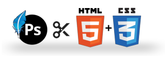 <!-- {.push-right} -->


  **Designers usam editores de imagens** (como o Photoshop) para
  **criar páginas web bonitas**
- O Photoshop gera uma imagem, que precisa ser "cortada" e transformada
    em uma página HTML e código CSS
- O designer tipicamente cria um (a) **_layout_** e uma (b) **especificação** da
  página, **para orientar o programador**
  1. (a) Também chamada de _comp_ ou _comprehensive layout_
  2. (b) Também chamada de _specs_

---

<!-- {"hash": "quebra-de-linha"} -->
# Quebra de linha (tag `<br>`)

- A _tag_ `<br>` funciona para quebrarmos linha em um parágrafo
  - `<br>` vem de _break line_
- Utilize-a para **quebrar linhas**, porém, **não** para separar parágrafos
  ou outros elementos
- Exemplo: escrevendo um poema

<iframe width="400" height="460" src="https://jsfiddle.net/fegemo/5xfek8yq/embedded/html,result" allowfullscreen="allowfullscreen" frameborder="0" class="rounded bordered flex-align-center"></iframe>


---
<!-- {"embeddedStyles": ".box-model-part {color: #333; border-radius: 4px; font-style: normal; padding: 1px 3px; } .box-model-part code { background: initial; }", "backdrop": "oldtimes", "hash": "box-model"} -->
## _Box Model_ ([na MDN](https://developer.mozilla.org/en-US/docs/Web/CSS/box_model))

-  <!-- {.push-right} -->
  O navegador enxerga todo elemento de conteúdo como uma "caixa"
- A "caixa" é formada por:
  - Espaço do _conteúdo_ <!-- {.box-model-part style="background: #8bb4c0;"} -->
  - Espaço de _preenchimento (`padding`)_ <!-- {em:.box-model-part style="background: #c2ce89;"} -->
  - Bordas _(`border`)_ <!-- {em:.box-model-part style="background: #fddc9a;"} -->
  - Espaço _externo (`margin`)_ <!-- {em:.box-model-part style="background: #f9cc9d;"} -->

<!-- {ul^1:style="margin-bottom: 0;"} -->

 <!-- {p:.centered.no-margin.invert-colors-dark-mode} -->

---
<!-- {"backdrop": "oldtimes"} -->
## _Box Model_: **largura** e **altura**

- Quando definimos a **largura** (`width`) ou **altura** (`height`) de
  um elemento, estamos definindo o tamanho
  do _conteúdo da caixa_, <!-- {em:.box-model-part style="background: #8bb4c0;"} -->
  e não da caixa inteira

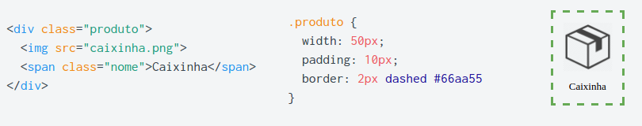<!-- {.bullet.figure-step.bullet-no-anim.rounded.bordered} -->
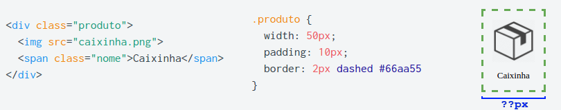<!-- {.bullet.figure-step.bullet-no-anim.rounded.bordered} -->
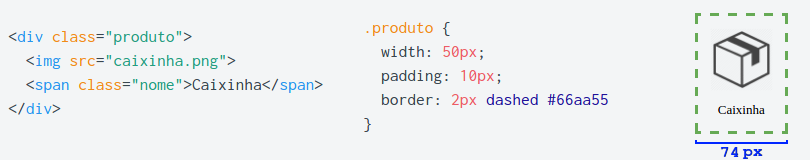<!-- {.bullet.figure-step.bullet-no-anim.rounded.bordered} -->
<!-- {.bullet.figure-step.bullet-no-anim.rounded.bordered} -->
<!-- {.bullet.figure-step.bullet-no-anim.rounded.bordered} -->
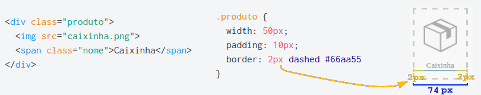<!-- {.bullet.figure-step.bullet-no-anim.rounded.bordered} -->

---
<!-- {"layout": "tall-figure-right", "hash": "alterando-o-box-model", "backdrop": "oldtimes"} -->
## Alterando o _box model_

As **margens** de um elemento formam um **espaçamento externo** e não contam
espaço dentro da caixa.

- É possível alterar o significado da `width` e `height` que damos a um elemento <!-- {ul:style="margin-bottom: 0"} -->
   <br>**usando _a propriedade `box-sizing`_** <!-- {em:.underline.upon-activation.delay-3000} -->:
  - `box-sizing: content-box` (valor padrão)
    - `width` = largura do _conteúdo_ <!-- {.box-model-part style="background: #8bb4c0;"} -->
  - `box-sizing: border-box`
    - `width` = _conteúdo_ <!-- {.box-model-part style="background: #8bb4c0;"} --> +
      _padding_ <!-- {.box-model-part style="background: #c2ce89;"} --> +
      _border_ <!-- {.box-model-part style="background: #fddc9a;"} -->
    - Esta forma é mais intuitiva :thumbsup: :thumbsup: :thumbsup:

<!-- {.bullet.figure-step.bullet-no-anim.rounded.bordered} -->
<!-- {.bullet.figure-step.bullet-no-anim.rounded.bordered} -->
<!-- {.bullet.figure-step.bullet-no-anim.rounded.bordered} -->
<!-- {.bullet.figure-step.bullet-no-anim.rounded.bordered} -->

---
<!-- {"layout": "centered"} -->
# Referências

1. Capítulos 5 e 6 do livro
