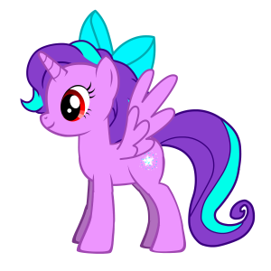

<!-- {"layout": "section-header", "hash": "unicornios"} -->
# _Unicorns are real_
## Conheça a verdade

 <!-- {.portrait.push-right} -->
- Atividade de hoje
  - _Layouts_ no Photoshop
  - Quebrando linhas no texto
  - Relembrando o _Box Model_
<!-- {ul:.content} -->

---

# Atividade de Hoje

- Criar uma página para expor a verdade sobre esses pôneis.
  - Seu amigo _designer_ criou um _layout_ no Photoshop para sua página e você
    deve criá-la de forma a reproduzir esse _layout_ na sua página HTML
  - Você pode ver o _layout_ na página seguinte
  - Você vai precisar lembrar: `div`, `span`, _Box Model_,
    `float` e `clear`
- [Baixe os arquivos][unicorns-seminal] contendo o HTML e estilize a
  página pra que ela fique idêntica ao _layout_ do _designer_
  - Leia as instruções detalhadas no arquivo `README.md`

[unicorns-seminal]: https://github.com/fegemo/cefet-front-end-unicorns/archive/master.zip

---