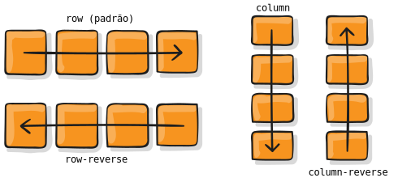
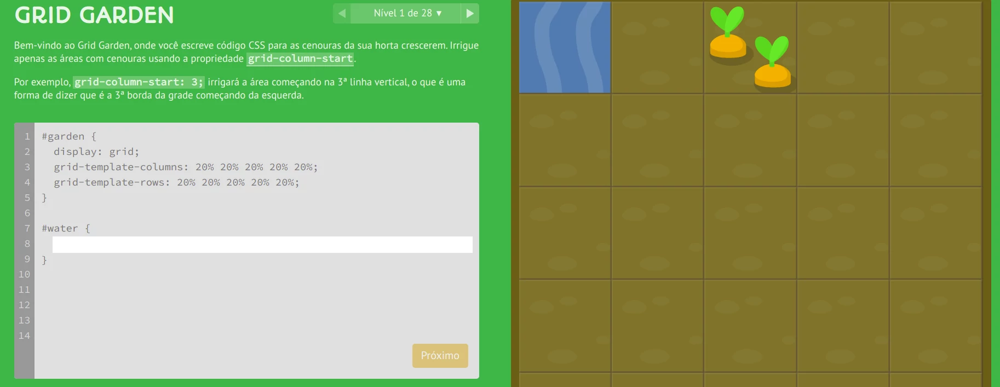
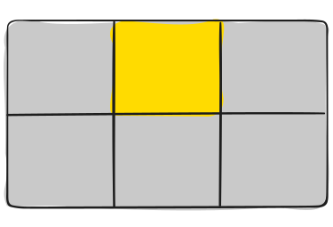

<!-- {"layout": "title"} -->
# **CSS** parte 4
## Display, Flexbox e Grid 🐸🥕

---
# Na última aula (1/3)

- Formatos de Imagens
  - **JPEG** <!-- {strong:.alternate-color} --> (ou JPG), bom para **fotos**
    tiradas do mundo real, que possuem muita variação de cor. Não possui
    transparência
  - **GIF** <!-- {strong:.alternate-color} -->, **transparência** de 1 bit e
    suporta **animações** de quadros
    - Apenas 256 cores na imagem (muito pouco!!)
  - **PNG** <!-- {strong:.alternate-color} -->, **transparência** de 8 bits
    e suporta **mais cores** que GIF
    - Bom formato para imagens com pouca variação de cor
  - **SVG** <!-- {strong:.alternate-color} -->, imagens **vetoriais** que não
    perdem qualidade se **ampliadas**

---
<!-- {"classes": "compact-code-more"} -->
# Na última aula: **vídeos** (2/3)

```html
<video src="videos/fendadobiquini.mp4" controls></video>
```
- Para aumentar a compatibilidade: <!-- {ul:.compact-code} -->
  ```html
  <video width="320" height="240" controls>
    <source src="bob-esponja.mp4" type="video/mp4; codecs=avc1.42E01E,mp4a.40.2">
    <source src="bob-esponja.webm" type="video/webm; codecs=vp8,vorbis">
    Seu navegador não suporta o elemento video.
  </video>
  ```
- O navegador tentará abrir o vídeo `bob-esponja.mp4` (_i.e._, o primeiro)
  - se não conseguir, tentará o arquivo `bob-esponja.webm` (2º)
  - se, mesmo assim, não conseguir, será exibido o texto

---
<!-- {"classes": "compact-code-more"} -->
# Na última aula: **_Web Fonts_** (3/3)

1. Descrever a fonte no arquivo CSS usando `@font-face {...}`: <!-- {ol:.compact-code} -->
   ```css
   @font-face {
     font-family: "Emblema One";    /* dando um nome à fonte */
     src: url("fonts/EmblemaOne-Regular.woff2") format('woff2'), /* 1º formato */
          url("fonts/EmblemaOne-Regular.ttf")   format('ttf');   /* 2º formato */
   }
   ```
2. Usar a fonte:
   ```css
   h1 {
     font-family: "Emblema One", sans-serif;
   }
   ```
   - Sempre coloque uma segunda opção (_e.g._, `sans-serif`)

---
<!-- {"layout": "centered"} -->
# Roteiro de hoje

1. [Propriedade `display`](#a-propriedade-display)
1. [Flexbox](#flexbox)
1. [Grid](#grid)

---
<!-- {"layout": "section-header", "hash": "a-propriedade-display"} -->
# A propriedade **display**
## e seus diversos valores

- Valores:
  - `block`
  - `inline`
  - `inline-block`
  - `none`
  - `table`
  - `table-row`
  - `table-cell`
  - `flex` e `inline-flex`  <!-- {.emoji} -->
  - `grid` e `inline-grid`  <!-- {.emoji} -->
<!-- {ul^1:.content} -->

---
## A propriedade **display** (na [MDN](https://developer.mozilla.org/en-US/docs/Web/CSS/display))

- Define o **tipo de visualização** de um elemento e também seu
  **comportamento** no fluxo da página
- Os valores mais "tradicionais" <!-- {li:.bullet} -->
  - `block`, para definir um elemento com comportamento `block`
  - `inline`, similarmente, para `inline`
  - `inline-block`, similar a `block`, porém sem quebra de linha
  - `none`, sem renderização
- Veremos esses primeiro, depois `table-*` e os bacanões `flex` e `grid` <!-- {li:.bullet} -->

---
## A propriedade **display** (cont.)

- É possível, por exemplo:
  ```css
  div { display: inline; }
  span { display: block; }
  ```

  - Mas é claro que você não vai fazer isso... ;)
- Para **remover um elemento do fluxo e não renderizá-lo** de forma alguma:
  ```css
  a[href*="xxx"] { display: none; }
  ```

---
## Display: **inline-block**

- Une a **capacidade de se <u>definir dimensões</u> de `block`** e a
  possibilidade de **ter um <u>fluxo lateral</u>** (sem quebra de linha), como
  `inline`. Exemplo:
  ```html
  <div class="passo">Instalar</div>
  <div class="passo">Aprender</div>
  <div class="passo">Programar</div>
  ```
  ```css
  .passo {
    display: inline-block;
    width: 150px;
    height: 150px; /* ... */
  }
  ```

---
## Resultado do display **inline-block**

<iframe width="600" height="400" src="//jsfiddle.net/fegemo/2gfkyrrh/3/embedded/result,html,css/" allowfullscreen="allowfullscreen" frameborder="0" class="flex-align-center bordered rounded"></iframe>

---
<!-- {"layout": "tall-figure-right", "scripts": ["../../scripts/classes/caniuse.min.js"]} -->
## Display: **table-***

<div class="caniuse" data-feature="css-table" style="justify-self: flex-end"></div>

- Alguns valores são para a criação de _layouts_ em formato de tabelas:
  - `table`, `table-cell`, `table-column`, `table-column-group`,
    `table-footer-group`, `table-header-group`, `table-row`,
    `table-row-group`, `inline-table`
- Veja alguns [exemplos de uso](http://colintoh.com/blog/display-table-anti-hero) no link

**Hoje em dia**: preferimos _flex_ ou _grid_ ;) <!-- {p:.span-columns.note.info} -->

---
<!-- {"layout": "section-header", "hash": "flexbox"} -->
# Flexbox
## Layouts de 1D

- `flex`, `inline-flex`
- Propriedades acessórias
- Exemplos
<!-- {ul:.content} -->


---
<!-- {"layout": "tall-figure-left", "slideStyles": {"grid-template-columns": "auto 1fr"}} -->
## Display: **flex** e **inline-flex**  <!-- {.emoji} -->

<div class="caniuse" data-feature="flexbox"></div>

- Mais recentemente, o CSS3 introduziu o **flexbox**
- É uma forma **bem flexível** para dispor os elementos
- Cria uma linha (`row`) ou coluna (`column`) com filhos
- Além de `display: flex` e `display: inline-flex`, foram introduzidas outras propriedades. Exemplos:

`flex-direction` <!-- {dl:.span-columns.width-20.full-width.no-margin} -->
~ `row` (padrão), `column`, `row-reverse`, `column-reverse`
~ dispõe filhos na horizontal (se `row`) ou vertical (`column`)

`justify-content`
~ `flex-start` (padrão), `center`, `space-around`, `space-between`...
~ define como distribuir o espaço que sobrou

`align-items`
~ `stretch` (padrão), `flex-start`, `center`...
~ define posição dos elementos no "contraeixo"

---
<!-- {"layout": "2-column-content", "embeddedStyles": ".horizontal-flex-example li { font-size: .8em; flex: 1; margin-right: 4px; background: #fffc; outline: 1px solid silver; } .horizontal-flex-example { display: flex; justify-content: space-between; list-style-type: none; padding-left: 0; }"} -->
## Exemplo com flexbox: lista horizontal

```css
ul.horizontal {
  display: flex;
  justify-content: space-around;

  /* tirar coisas que vem na <ul> */
  list-style-type: none;
  padding-left: 0;
}

ul.horizontal > li {
  flex: 1; /* crescer com peso 1 */
  
  /* espacinho e centralização */
  margin-right: 4px;
  text-align: center;
}
```

- result . text-align: center
  - Abacaxi <!-- {ul:.horizontal-flex-example} -->
  - Kiwi
  - Maçã
  - Uva
  - Limão
  
- Colocamos `display: flex` **no pai** <!-- {ul^1:.no-bullets.no-padding.bulleted-0} -->
- Faz os filhos se comportarem de um jeito diferente
- Vamos usar outras propriedades (além de `display`). Ex:
  1. `flex-direction` (**linha** ou coluna)
  1. `justify-content` (como dist. espaço)
  1. `flex-wrap` (continuar na próxima linha ou coluna?)

---
<!-- {"layout": "2-column-content", "hash": "como-funciona-o-flexbox"} -->
## Como funciona o flexbox <small>(1/3)</small>

 <!-- {.full-width} -->
1. Ideia: habilidade do elemento alterar o tamanho de seus filhos (e ordem) para ocupar o espaço disponível <!-- {ol:start="0"} -->
1. Há propriedades para o **elemento flex** e para seus **filhos** <!-- {.alternate-color} -->
   - Apenas o pai tem `display: flex`


**`flex-direction`** define o **eixo principal** e o contraeixo
 <!-- {.large-width.centered.block} -->
- **`flex-wrap`** se precisar quebra linha?
 <!-- {.large-width.centered.block} -->

---
<!-- {"layout": "3-column-content"} -->
## Como funciona o flexbox <small>(2/3)</small>

**`justify-content`** distribui espaço em branco no eixo principal
 <!-- {.medium-width.centered.block} -->

**`align-items`** alinhamento no contraeixo
 <!-- {.large-width.centered.block} -->

**`align-content`** distribui espaço em branco no contraeixo
 <!-- {.large-width.centered.block} -->
- Só se `flex-wrap` !== `nowrap`

---
<!-- {"layout": "3-column-content"} -->
## Como funcionam os **filhos** de flexbox  <!-- {.alternate-color} -->   <small>(3/3)</small>

**`flex`** <!-- {.alternate-color} --> define o peso do elemento no eixo na hora de definir seu tamanho
 <!-- {.large-width.centered.block} -->
- ⬆️ na verdade, é atalho para `flex-grow`, `flex-shrink` e `flex-basis`

**`align-self`** <!-- {.alternate-color} --> alinhamento no contraeixo apenas deste filho
 <!-- {.large-width.centered.block.bullet} -->
1. **`gap`** define um espaço mínimo entre filhos
   <!-- {li:.bullet} -->
    <!-- {.medium-width} -->
     <!-- {ul:.no-bullets} -->

**`order`** <!-- {.alternate-color} --> define uma ordem diferente da do código fonte
 <!-- {.large-width.centered.block} -->

---
<!-- {"layout": "section-header", "hash": "grid"} -->
# Grid
## Layouts de 2D

- Propriedades acessórias
- Exemplos
- Grid Garden
<!-- {ul:.content} -->

---
# CSS **Grid** Layout

- Flexbox é ótimo para layouts de 1 dimensão (linhas ou colunas)
- Grid cria layouts de 2 dimensões (linhas e colunas)
- Além de `display: grid` (e `inline-grid`), várias novas propriedades foram introduzidas
- Há propriedades para o **elemento grid** e para os **filhos de grid** <!-- {.alternate-color} -->
  - Algumas propriedades do Flexbox também são usadas
- Deve-se definir as linhas e colunas e seus tamanhos

---
<!-- {"layout": "2-column-content", "classes": "compact-code-more"} -->
## Exemplo usando `grid`

- HTML <!-- {ul:.no-bullets.no-padding} -->
  ```html
  <main>
    <header></header>
    <nav></nav>
    <section></section>
    <footer></footer>
  </main>
  ```
- CSS (elemento pai)
  ```css
  main {
    display: grid;
    grid-template-rows: 200px 1fr auto;
    grid-template-columns: 300px 1fr;
  }
  ```

  - CSS (dos filhos) <!-- {ol:.no-bullets.no-padding.two-column-code} -->
   ```css
   header {
     grid-column: 1 / 3;
   }

   nav {
     grid-column: 1 / 2;
     grid-row: 2 / 3;
   }
   section {
     grid-column: 2 / 3;
     grid-row: 2 / 3;
   }
   footer {
     grid-column: 1 / 3;
     grid-row: 3 / 4;
   }
   ```
   <header style="background: lightblue; grid-column: 1/3;"></header>
   <nav style="background: black; grid-column: 1/2; grid-row: 2/3;"></nav>
   <section style="background: green; grid-column: 2/3; grid-row: 2/3;"></section>
   <footer style="background: gray; grid-column: 1/3; grid-row: 3/4; min-height: 40px;"></footer>

---
<!-- {"layout": "main-point", "state": "emphatic"} -->
# Conheça o Grid Garden 🥕

---
# Jogo [Grid Garden 🌐][grid-garden] <!-- {target="_blank"} --> <span style="font-family: 'Source Code Pro', monospace; font-size: 0.25em; opacity: 0.5;">~ melhor professor de grid ~</span>

 <!-- {.full-width.bordered.rounded} -->

[grid-garden]: https://cssgridgarden.com/#pt-br

---
<!-- {"layout": "3-column-content", "hash": "conceitos-sobre-grid"} -->
## Conceitos sobre Grid

- **Elemento grid**: <!-- {ul:.no-padding.no-bullets} -->
  aquele que tem `display: grid` ou `inline-grid`
- **Filho de grid**: <!-- {.alternate-color} -->
  todos os filhos diretos de um **elemento grid**
   <!-- {.large-width.centered.block style="margin-top: 1.75em;"} -->

1. **Calha**<!-- {style="color: unset"} -->: <!-- {ol:.no-bullets.no-padding} -->
   traço entre linhas ou colunas (ou início/final)
    <!-- {.medium-width.centered.block} -->
1. **Célula**<!-- {style="color: unset"} -->:
   espaço entre quatro calhas
    <!-- {.medium-width.centered.block} -->

- **Trilha**<!-- {style="color: unset"} -->: linha ou coluna <!-- {ul:.no-bullets.no-padding} -->
   <!-- {.medium-width.centered.block} -->
- **Área**<!-- {style="color: unset"} -->: conjunto adjacente e retangular de células
   <!-- {.medium-width.centered.block} -->

---
<!-- {"layout": "2-column-content", "classes": "compact-code-more", "hash": "como-funciona-o-grid"} -->
## Como funciona o Grid <small>(1/3)</small>

- <!-- {ul:.no-bullets.no-padding.no-margin} -->
  **`grid-template-columns`**, **`grid-template-rows`** definem quantidade e tamanho de colunas e linhas
  ```css
  .container {
    grid-template-columns: 40px 50px auto 50px 40px;
    grid-template-rows: 25% 100px auto;
  }
  ```
 <!-- {.medium-width.centered.block} -->

   **`grid-column`**<!-- {.alternate-color} -->, **`grid-row`** <!-- {.alternate-color} --> especifica as <u>calhas</u> da célula onde o filho será colocado 
   ```css
   .item-a {
     grid-column: 2 / 5;
     grid-row: 1 / 3;
   }
   ```
 <!-- {.medium-width.centered.block} -->

---
<!-- {"layout": "2-column-content", "classes": "compact-code-more"} -->
## Como funciona o Grid <small>(2/3)</small>

  **`grid-template-areas`** dá nomes às áreas da grid
  ```css
  .container {
    display: grid;
    grid-template-columns: repeat(1fr, 4);
    grid-template-rows: repeat(1fr, 3);
    grid-template-areas: 
      "header header header header"
      "main main . sidebar"
      "footer footer footer footer";
  }
  ```
  - Um `.` é uma célula vazia
  - `repeat(n, valor)` é um atalho

   **`grid-area`**<!-- {.alternate-color} --> especifica nome da <u>área</u> onde o filho será colocado 
   ```css
   .item-a {
     grid-area: header;
   }
   .item-b {
     grid-area: main;
   }
   .item-c {
     grid-area: sidebar;
   }
   .item-d {
     grid-area: footer;
   }
   ```
 <!-- {.medium-width.centered.block} -->
<!-- {li:.no-bullets.no-padding} -->

---
<!-- {"layout": "2-column-content", "classes": "compact-code"} -->
## Como funciona o Grid <small>(3/3)</small>

- Além dessas propriedades, há várias outras
  1. **`gap`**: define espaço entre linhas e colunas
      <!-- {.small-width.centered.block} --> 
     ```css
     .container {
       gap: 15px 10px;
     }
     ```

1. **`justify-items`** <!-- {ol:start="2"} -->
1. **`align-items`**
1. **`justify-content`**
1. **`align-content`**
1. **`grid-auto-columns`**, **`grid-auto-rows`**
1. **`justify-self`** <!-- {.alternate-color} -->
1. **`align-self`** <!-- {.alternate-color} -->
1. Veja o [guia completo de Grid][grid-css-tricks] em CSS Tricks <!-- {li:.note.info} -->

[grid-css-tricks]: https://css-tricks.com/snippets/css/complete-guide-grid/

---
<!-- {"layout": "centered"} -->
# Referências

- [Guia completo de Flexbox][flex-css-tricks] em CSS Tricks
- [Guia completo de Grid][grid-css-tricks] em CSS Tricks

[flex-css-tricks]: https://css-tricks.com/snippets/css/a-guide-to-flexbox/
[grid-css-tricks]: https://css-tricks.com/snippets/css/complete-guide-grid/