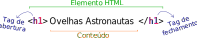

<!-- {"layout": "title"} -->
# **HTML** parte 1

---
## Na última aula...

- Conversamos sobre a história da Internet e da Web
-  <!-- {.portrait.push-right} --> Vimos as proezas de Tim (Berners-Lee), o coração valente, ao criar:
  - O protocolo HTTP
  - A linguagem HTML
  - Um servidor web (CERN httpd)
  - O primeiro navegador (WorldWideWeb)
  - ~~A linguagem CSS~~ (não foi o Tim :scream:)
  - ~~A linguagem JavaScript~~ (não foi o Tim :scream:)

---

# Hoje vamos...

1. Rever o [funcionamento](#funcionamento-web) dos servidores e navegadores
1. Conhecer a [estrutura básica](#estrutura-basica-html) de um arquivo HTML
1. Aprender algumas [_tags_ HTML para texto](#tags-html):
   - parágrafos `<p>...</p>`
   - títulos `<h1>...</h1>`, ou `<h2>...</h2>` etc. (até `<h6>...</h6>`)
   - imagens ``
   - hiperlinks `<a href="">...</a>`
1. Entender um pouco de [estilo CSS](#estilo-css):
   - `color`, `background-color`
   - `margin`, `text-align`

---
<!-- {"layout": "section-header", "hash": "funcionamento-web"} -->
# Funcionamento da Web
## Como o navegador conversa com o servidor

- Modelo de **requisição e resposta**
  1. **Navegador** requisita uma página
  1. **Servidor** responde
- **URL**: como identificar um recurso

<!-- {ul:.content} -->

---
<!-- {"embedSVG": "img[src$='.svg']", "embeddedStyles": ".http-diagram .step-3 .level-3 { visibility: visible !important; }"} -->
## O que um **navegador** faz?

- Quando o usuário "vai" até um novo endereço (URL), o navegador solicita esse
  **recurso** ao servidor
  - O **Navegador requisita** algo e **Servidor responde**

<!-- {ol:.layout-split-2.bulleted.no-bullets.no-margin.no-padding.compact-code-more.http-diagram} -->
 <!-- {.centered.step-3.invert-colors-dark-mode style="max-width: 100%; max-height: 236px"} -->
1. Requisição: <!-- {ul:.no-bullets.no-padding} -->
   ```http
   GET /index.html HTTP/1.1
   Host: www.twitter.com
   ```
1. Resposta:
   ```http
   HTTP/1.1 200 OK
   Date: Mon, 23 May 2005 22:38:34 GMT
   Server: Apache/1.3.3.7 (Unix) (Red-Hat/Linux)
   Content-Type: text/html; charset=UTF-8
   Content-Length: 131 

   <!DOCTYPE html>
   <html>
   <head>
     <title>Twitter</title>
   </head>
   <body>
     Olá mundo, este é um tweet.
   </body>
   </html>
   ```

---
## O que é um URL?

- URL: Unique **Resource** Locator <!-- {ul:.bulleted} -->
  - É o **endereço de coisas**: **páginas, imagens, arquivos**, etc.   
     <!-- {.block.full-width} -->
    
    domínio <!-- {dl.bulleted} -->
    ~ Em que computador estão os arquivos

    porta
    ~ Qual endereço do programa dentro do computador

    caminho
    ~ Qual o endereço até o arquivo

- Assim que recebe a resposta, o navegador mostra na tela, _se der_
 
*[URL]: Unique Resource Locator*

---
<!-- {"layout": "section-header", "hash": "estrutura-basica-html"} -->
# Estrutura Básica do **HTML**
## Estrutura  <!-- {style="visibility: hidden;"} -->

- Um arquivo HTML completo
  - `<html>...</html>`
  - `<head>...</head>`
  - `<body>...</body>`
<!-- {ul^1:.content} -->

---

<TABLE><TR>
<TH><H1>CÓDIGO</H1></TH><TH><H1>RESULTADO</H1></TH></TR><TR>
<TD></TD><TD></TD></TR>
</TABLE>

---
## Estrutura de um arquivo HTML

- Um punhado de **tags** no texto <!-- {ul:.bulleted-0} -->
  - As _tags_ fazem a marcação da estrutura do texto
  - Existem dezenas de tags (umas 80? 100?) e cada uma tem um propósito e um
    resultado visual
  - A grande maioria delas precisam ser fechadas
    - Por exemplo: parágrafo (`<p>...</p>`), título (`<h1>...</h1>`)
    - Contraexemplo: imagem (``)
- **Indentação e espaçamento** são livres e não afetam o resultado
- Um arquivo html é _plain-text_, ou puramente textual
  - em contraposição a um arquivo binário, por exemplo

---
<!-- {"layout": "2-column-content"} -->
## A _tag_ &lt;html&gt;

- Envolve **todas** as outras _tags_ <!-- {ul:.bulleted} -->
  - **Exceto** a _tag_ especial `<!DOCTYPE html>`
- Dentro dela, devem sempre existir as seguintes _tags_, nesta ordem:
  - `<head>...</head>`
  - `<body>...</body>`

```html
<!DOCTYPE html>          
<html>  ⬅️         
  <head>
    ...
  </head>
  <body>
    ...
  </body>
</html> ⬅️
```

---
<!-- {"layout": "2-column-content"} -->
## A _tag_ &lt;head&gt;

- Do inglês: cabeça
- Contém **meta-informação** sobre este arquivo HTML, por exemplo: <!-- {li:.bulleted} -->
  - **Codificação** (_encoding_) da página
  - **Título da página** na aba/janela do navegador
  - Iconezinho (_favicon_)
  - Inclusão de outros arquivos (`.css`, `.js`)

```html
<!DOCTYPE html>
<html>
  <head>   ⬅️
    <meta charset="utf-8">  <!-- codific. -->
    <title>Título na aba/janela</title>
    <link rel="icon" href="icone.png">
    ...
  </head>  ⬅️
  <body>
    ...
  </body>
</html>
```

---
<!-- {"layout": "2-column-content"} -->
## A _tag_ &lt;body&gt;

- Do inglês: corpo
- Contém **todo o conteúdo da página**: _tags_ de
  - parágrafos (`<p>...</p>`)
  - títulos e subtítulos (`<h1>...</h1>`)
  - imagens (``), etc.
- É tudo visível logo abaixo da barra de endereços até o "chão"

```html
<!DOCTYPE html>
<html>
  <head>...</head>
  <body>   ⬅️
    ...
    <h1>Título Grandão</h1>
    ...
    <p>Um textinho qualquer</p>
    
    ...
  </body>  ⬅️
<html>
```

---
<!-- {"layout": "section-header", "hash": "tags-html"} -->
# Algumas _tags_ HTML
## _tags_ HTML <!-- {style="visibility: hidden"} -->

- Anatomia de uma _tag_
- Parágrafo
- Títulos e subtítulos
- Imagens
- Hiperlinks
<!-- {ul:.content} -->

---
<!-- {"embedSVG": "img[src$='.svg']", "styles": ["../../styles/classes/tag-anatomy.min.css"]} -->
## Anatomia de uma **_tag_**

 <!-- {p:.bullet.figure-step.bullet-no-anim.step-0} -->

- Tags de abertura podem ter **atributos**: <!-- {ul:.bulleted} -->
  ```html
  
  ```
  - Em ``, o atributo `src="..."` aponta para a URL do arquivo
  - **Não deve haver espaço** entre seu nome e seu valor:
    - `` <span style="color: red">:thumbsdown:</span>
    - `` <span style="color: green">:thumbsup:</span>

---
<!-- {"hash": "tag-paragrafo"} -->
## _Tag_ de **<u>Parágrafo</u>** (`<p>...</p>`)

- **Quebras de linha** são feitas automaticamente <!-- {li:.compact-code} -->
  ```html
  <p>
    "Um dos maiores problemas encontrados em viajar no tempo não é vir a se tornar
    acidentalmente seu próprio pai ou mãe. Não há nenhum problema em tornar-se
    seu próprio pai ou mãe com que uma família de mente aberta e bem ajustada não
    possa lidar."
  </p>
  ```
  ::: result . width: 80%; margin: 1em auto;
  "Um dos maiores problemas encontrados em viajar no tempo não é vir a se tornar acidentalmente seu próprio pai ou mãe. Não há nenhum problema em tornar-se seu próprio pai ou mãe com que uma família de mente aberta e bem ajustada não possa lidar."
  :::

---
<!-- {"layout": "2-column-content","hash": "tag-titulo-subtitulo"} -->
## _Tag_ de **<u>Títulos</u>** e **<u>Subtítulos</u>** (`h1`, `h2` ... `h6`)

```html
<h1>Título de 1º nível</h1>
<p>Este é o corpo da seção</p>
<h2>Subtítulo (2º nível)</h2>
<p>Este é o corpo da subseção</p>
```

<iframe width="100%" height="230" src="//jsfiddle.net/fegemo/wxd5s6be/2/embedded/result/" allowfullscreen="allowfullscreen" frameborder="0"></iframe>

- Há a possibilidade de ter **6 <u>níveis</u> de títulos**
  - Mas a quantidade de títulos é infinita... por exemplo :arrow_right:

<iframe width="100%" height="230" src="//jsfiddle.net/fegemo/qLc41vs3/embedded/html,result/dark/" allowfullscreen="allowfullscreen" frameborder="0"></iframe>

---
<!-- {"hash": "tag-imagem"} -->
## _Tag_ de **<u>Imagem</u>**: ``

-   
  <!-- {.push-right style="height: 100px; margin-left: 1em"} -->
  Para exibir imagens...
  ```html
  
  ```
- Neste exemplo, usamos **a URL de uma imagem hospedada em outro
  site** na Internet
- O atributo `src="..."` (abreviação de _source_) é usado para definir o
  endereço (URL) da imagem
- Uma URL pode ser **externa** ou **interna** <!-- {.alternate-color} -->
  - Veja a diferença no próximo slide

---
## URL externa vs interna

URL **externa** <!-- {dl:.width-20.full-width} -->
  ~ Aponta para algo (imagem etc.) de um outro site
  ~ Quase sempre começa com `http://` ou `https://`. Exemplos:
    - http://google.com
    - http://fegemo.github.io/imgs/kraken.png
    - https://twitter.com/fegemo

URL **interna** <!-- {.alternate-color} -->
  ~ Aponta para algo da própria página/site
  ~ Pode ser um caminho <span class="badge type1">relativo</span> ou <span class="badge type2">absoluto</span>.
    - racas-raras.html <span class="badge type1">relativo</span>
    - imagens/ovelha.jpg <span class="badge type1">relativo</span>
    - ../imgs/logo.png <span class="badge type1">relativo</span>
    - <strong>/</strong>arquivos/fotosdafesta.zip <span class="badge type2">absoluto</span>

---
<!-- {"hash": "end-relativo-absoluto"} -->
## Exemplo 1: Arquivo HTML e imagem **na mesma pasta**

-  <!-- {.push-right style="height: 140px;"} -->
  Arquivo HTML está em:<br>`/ovelhas/racas/raras.html`
- A imagem está em:<br>`/ovelhas/racas/pira-tovelha.jpg`
  - Podemos utilizar seu endereço <span class="badge type2">absoluto</span>: `/ovelhas/racas/pira-tovelha.jpg`
    ```html
    
    ```
  - Ou seu endereço <span class="badge type1">relativo</span>: `pira-tovelha.jpg` (relativo à página atual) <!-- {li:.bullet} -->
    ```html
    
    ```
    - Apenas o nome da imagem, porque ela está <u>na mesma pasta</u> que
      o arquivo HTML <!-- {li:.bullet} -->

---
## Exemplo 2: Imagem 1 pasta adentro

 <!-- {.push-left style="height: 140px"} -->
<!-- {.push-right.invert-colors-dark-mode style="height: 140px"} -->

- Endereço <span class="badge type2">absoluto</span>: `/ovelhas/racas/img/pira-tovelha.jpg`
  ```html
  
  ```
- Endereço <span class="badge type1">relativo</span>: `img/pira-tovelha.jpg`
  ```html
  
  ```

---
## Exemplo 3: Imagem 1 pasta acima

<!-- {.push-left style="height: 140px"} -->
<!-- {.push-right.invert-colors-dark-mode style="height: 140px"} -->

- Endereço <span class="badge type2">absoluto</span>: `/ovelhas/pira-tovelha.jpg`
  ```html
  
  ```
- Endereço <span class="badge type1">relativo</span>: `../pira-tovelha.jpg`
  ```html
  
  ```

---
## Exemplo 4: Imagem 2 pastas acima

<!-- {.push-left style="height: 140px"} -->
<!--{.push-right.invert-colors-dark-mode style="height: 140px"} -->

- Endereço <span class="badge type2">absoluto</span>: `/pira-tovelha.jpg`
  ```html
  
  ```
- Endereço <span class="badge type1">relativo</span>: `../../pira-tovelha.jpg`
  ```html
  
  ```

---
<!-- {"layout": "2-column-content", "slideStyles": {"grid-template-rows": "auto auto 1fr"}} -->
## Sumarizando: **URLs absolutas e relativas**


 <!-- {.invert-colors-dark-mode} -->

| Endereço <span class="badge type2">absoluto</span>          	| Endereço <span class="badge type1">relativo</span> |
|:--------------------------	|:-------------	|
| /ovelhas/racas/c.jpg      	| c.jpg        	|
| /ovelhas/racas/xpto/d.jpg 	| xpto/d.jpg   	|
| /ovelhas/b.jpg            	| ../b.jpg     	|
| /a.jpg                    	| ../../a.jpg  	|

<!-- {table:.smaller-text-70} -->

- Prefira usar **endereços <span class="badge type1">relativos</span>** <!-- {ul:.span-columns} -->
  
  Ao abrir páginas HTML sem um servidor Web
  ("dando 2 cliques"), um endereço <span class="badge type2">absoluto</span> 
  começa na raiz do sistema de arquivos (_e.g._, "C:\") e não devemos especificar endereços dessa forma

---
<!-- {"hash": "tag-hiperlink"} -->
## _Tag_ de **_Hyperlink_** (`<a href="">...</a>`)

- [Link externo](http://www.google.com) (para fora da página):
  ```html
  <a href="http://www.google.com">Texto do link externo</a>
  ```

    <a href="http://www.google.com">Texto do link externo</a>


- [Link interno](../../attachments/exemplo.zip) (para algo hospedado no
  próprio computador)
  ```html
  <a href="downloads/exemplo.zip">Texto do link interno</a>
  ```

    <a href="../../attachments/exemplo.zip">Texto do link interno</a>

---
<!-- {"layout": "main-point", "state": "emphatic"} -->
## Como o navegador <u>vai desenhar</u> as _tags_ HTML?

- Ele usa estilos padrão:
  
  Cor do texto
  ~ preta
  
  Cor de fundo
  ~ branca

  Fonte
  ~ Times New Roman para títulos (no Windows)
  ~ Arial para parágrafos
- Cada navegador pode ter um estilo padrão diferente
- É possível e altamente recomendável <u>criar estilos próprios</u>
- Vamos conhecer agora uma segunda linguagem: CSS

---
<!-- {"layout": "section-header", "hash": "estilo-css"} -->
# Um pouco de estilo
## Conhecendo CSS - Cascading Stylesheets

- A _tag_ `<style>...</style>`
- Definindo as propriedades de:
  - Cor do texto: `color`
  - Cor do fundo: `background-color`
  - Margem (espaçamento): `margin`
  - Fonte: `font-family`
<!-- {ul^1:.content} -->

---
## Definindo o estilo (aparência)

- Adicionamos um novo elemento: `<style>...</style>`
- Podemos **colocá-lo no `<head>`** (boa prática) ou no `<body>` (não faça) <!-- {ul:.compact-code} -->
  ```html
  <!DOCTYPE html>
  <html>
    <head>
      <title>Título da página</title>
      <!-- início do CSS -->
      <style>
        body {
          background-color: teal; /* um tom de azul */
        }
      </style>
      <!-- fim do CSS -->
    </head>
    <body>
    ...
  ```

---
<!-- {"layout": "2-column-content", "classes": "compact-code-more"} -->
## Definindo o estilo (cont.)

- Estilizando a página dos _drinks_: <!-- {ul:.no-bullets.no-padding} -->
  ```css
  body {
    background-color: teal;
    color: white;
    margin-left: 20%;
    margin-right: 20%;
    font-family: "Arial", sans-serif;
  }

  h1 {
    color: yellow;
    font-family: "Courier New", monospace;
    text-align: center;
  }

  p {
    text-align: justify;
  }

  h2 {
    color: pink;
  }
  ```

<iframe width="100%" height="500" src="//jsfiddle.net/fegemo/ojmwh8gb/embedded/result,html,css/" allowfullscreen="allowfullscreen" frameborder="0"></iframe>

---
<!-- {"hash": "css-cores"} -->
## Entendendo o estilo: **cores**

  ```css
  body {
    background-color: teal;    
  }
  ```
  Define a **cor** (_color_) **do fundo** (_background_) para azul ocre (_teal_) <!-- {ul:.no-bullets.no-padding.bulleted-0} -->
  - Mas também poderia ser: `orange`, `red`, `green`, `black` etc.
  ```css
  body {
    color: white;
  }
  ```
  Define a **cor do texto** como branco

---
<!-- {"hash": "css-margens"} -->
## Entendendo o estilo: **margens laterais**

 <!-- {.push-right style="width: 50%; margin-left: 1em;"} -->
  ```css
  body {
    margin-left: 20%;
    margin-right: 20%;
  }
  ```
  Define as **margens** (espaço) laterais da página
  - Também existem: `margin-top` (cima) e `margin-bottom` (baixo)
  <!-- {ul^1:.no-bullets.no-padding.full-width} -->

---
<!-- {"hash": "css-fonte"} -->
## Entendendo o estilo: **fonte**

 <!-- {.push-right.invert-colors-dark-mode} -->
  ```css
  body {
    font-family: "Arial", sans-serif;
  }
  ```
  Define a **fonte** do texto **da página** <!-- {ul:.no-bullets.no-padding.bulleted-0} -->
  Dá 2 opções: se não tiver a 1ª, vai a 2ª
  ```css
  h1 {
    font-family: "Courier New", monospace;
  }
  ```
  Define a **fonte** sendo usada para o texto de **todos `<h1>` na página**

---
<!-- {"hash": "css-alinhamentoTexto"} -->
## Entendendo o estilo: **alinhamento do texto**

 <!-- {ul:.item-code-with-image.full-width.compact-code} -->
  ```css
  p {
    text-align: justify;
  }
  ```

  ```css
  p {
    text-align: left; /* valor padrão */
  }
  ```

  ```css
  p {
    text-align: right;
  }
  ```

  ```css
  p {
    text-align: center;
  }
  ```

---
<!-- {"layout": "centered"} -->
# Referências

1. Capítulo 1 do livro
