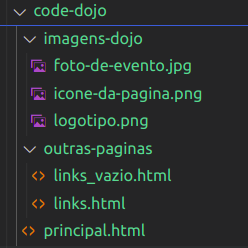
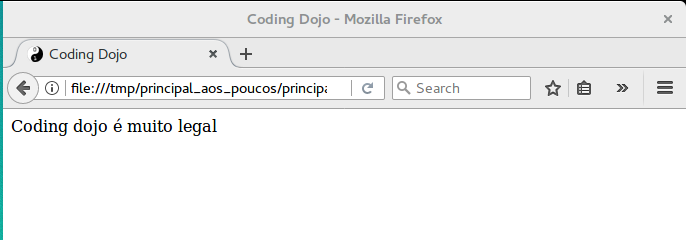
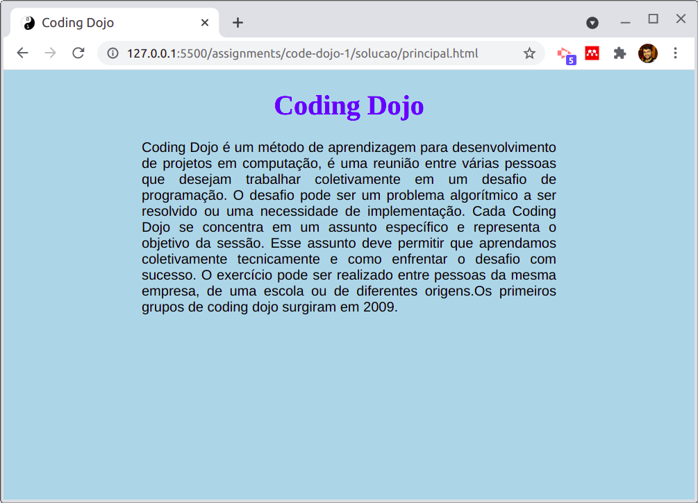
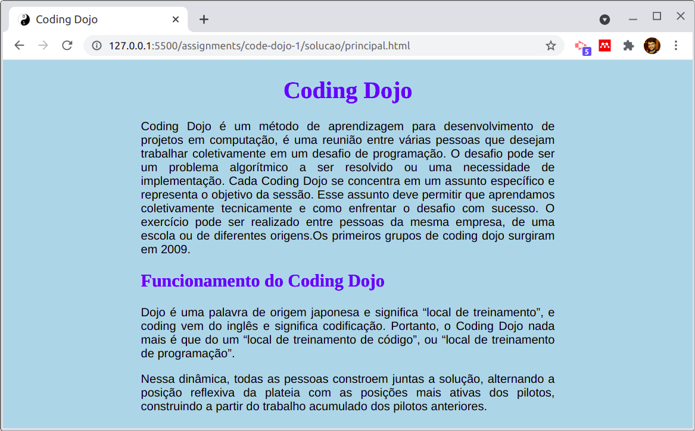
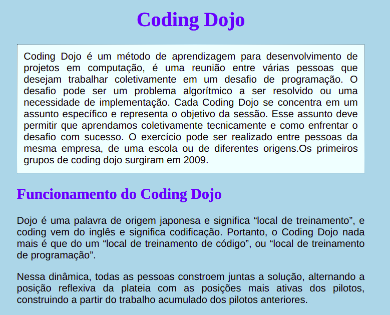
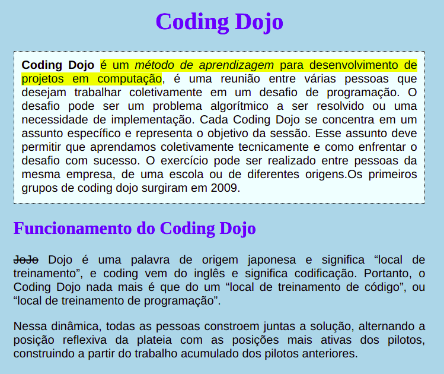
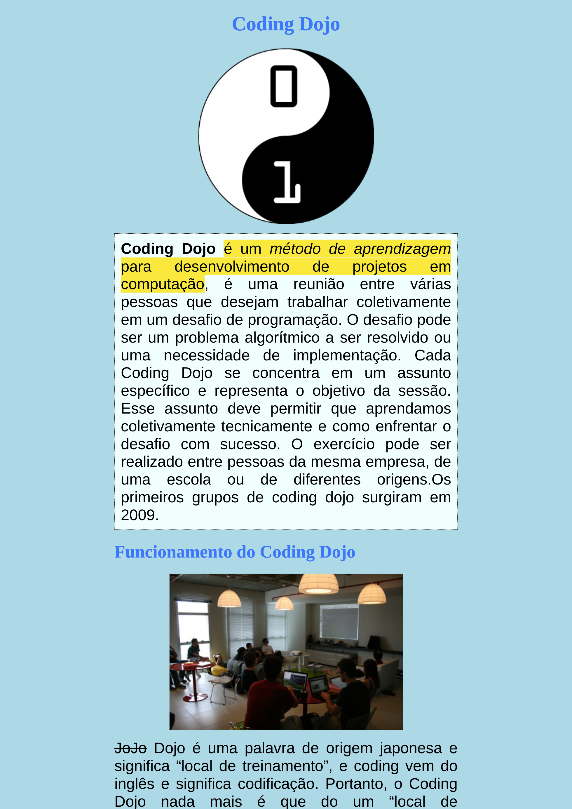
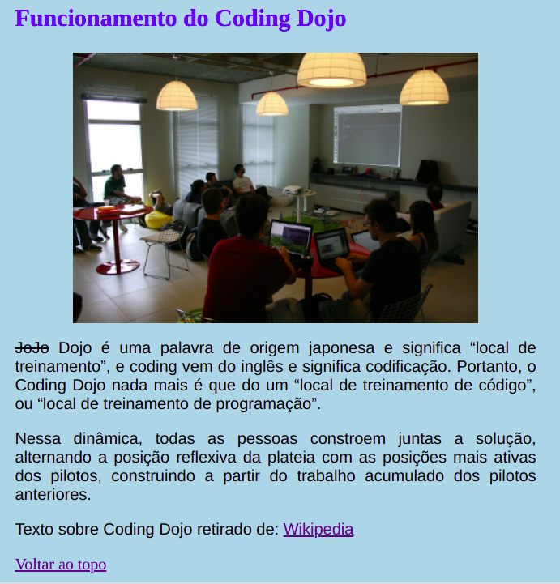
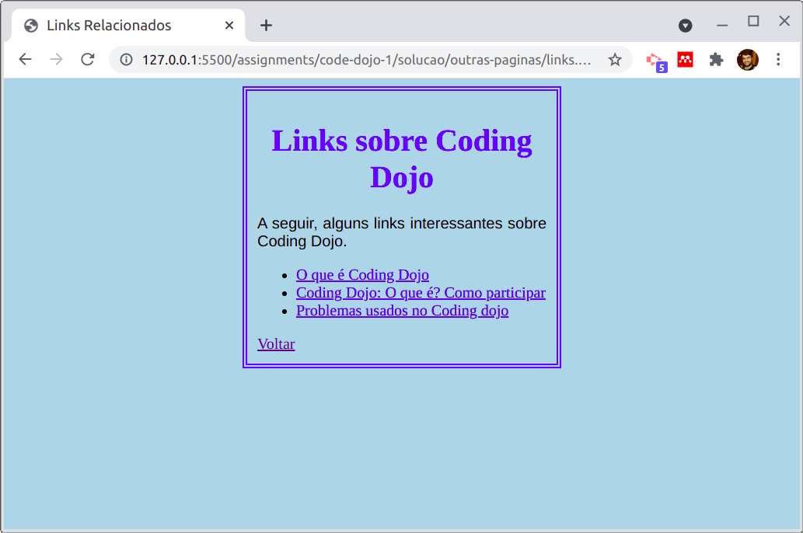
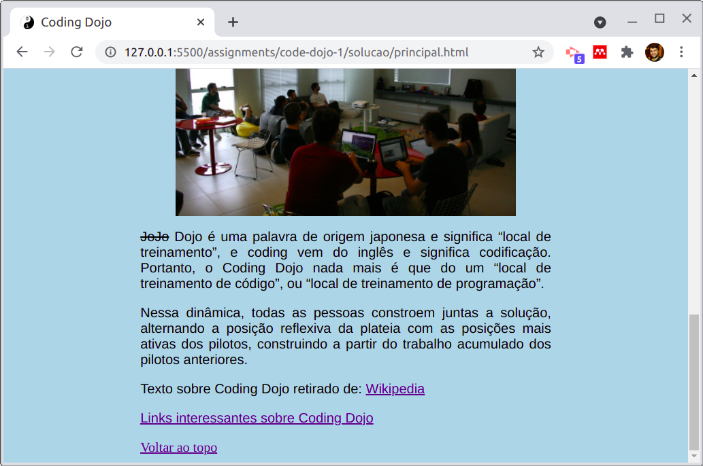

<!-- {"layout": "centered-horizontal"} -->
# Atividade de Hoje

<!-- {.push-left style="height: 100px;"} -->

Vamos fazer nosso primeiro **Code Dojo** :japanese_castle:!

---

<!-- {"layout": "centered"} -->
# O que é Coding Dojo? 

**Dojo**
- Local de treinamento :japanese_castle: (em japonês)
- Termo usado em artes marciais

**Coding Dojo**
- Local de treinamento para **codificar**

---
# Coding Dojo 
Codificação **em grupo**, em que o aluno pode desempenhar um dos três papeis:

**Piloto**:
  - Aluno que está programando

**Copiloto**:
  - Auxilia a programação ao lado do piloto
  - Pode ser chamada para ser **piloto**

**Platéia**:
  - Observa o código, auxilia quando necessário
  - Pode ser chamada para ser **piloto** ou **copiloto**

---
## Regras do Coding Dojo

- O valor da prática será perdido por:
  - Indisciplina e desrespeito
  - Aluno atrasado
  - Recusar a participação como piloto/copiloto
    - Ou não querer sair do computador, quando solicitado
    - Ou, ainda, tentar assumir a posição de piloto quando não é a sua vez
  - Fazer algo não relacionado ao exercício
  - Parar de participar por:
    - Usar outro computador
    - Conversa fora do assunto da aula
    - Usar a Internet a não ser para pesquisar
    - Uso de celular 

---
<!-- {"layout": "centered-horizontal"} -->
# Coding Dojo

Exercício: fazer uma página explicando o que é Coding Dojo

---
## Iniciando

1. Baixe um [arquivo compactado][baixar-imagens] com as imagens
1. Descompacte esse arquivo
1. Em um editor de texto (ex: VS Code), abra a pasta `code-dojo` inteira

  

-  Ao final da atividade, a estrutura de pastas será assim:

[baixar-imagens]: https://fegemo.github.io/cefet-front-end/assignments/code-dojo-1/code-dojo.zip

---
## 0. Criação da Página

- Na pasta `code-dojo`, **crie um arquivo HTML** (ex: `principal.html`)
- No início do HTML, **especifique a versão do HTML**: `<!DOCTYPE html>`
- Escreva as **tags principais no arquivo** (html, head  e body)
- **Coloque o título** (na aba do navegador) `Coding Dojo` <!-- {ul:.bullet} -->

**Dikentinha**: no VS Code, dentro de um arquivo já salvo no formato `.html`,
digite a palavra `html` e selecione a opção `html:5` (ou aperta <kbd>TAB</kbd>)
para autocompletar com o esqueleto básico de todo arquivo HTML.

---
## 1. Criação da Página

- **Utilize a propriedade charset** da tag `meta` (dentro do `head`) para garantir que o html seja lido da forma correta:
`<meta charset="utf-8">`

 

- Exiba um **ícone** para a página
  - Ícone pode ser encontrado na pasta `imagens-dojo` e o nome do arquivo é `icone-da-pagina.png`
  - Salve todas as imagens em uma pasta separada
- Para **testar**, escreva e exiba a frase `Coding dojo é muito legal` dentro do `<body>...</body>`

---
## 2. Título (primeiro nível) e estilos da página

 <!-- {.bordered.rounded.push-right style="height: 240px;"} -->

- Título (primeiro nível):
	- Cor da fonte: Azul (`blue`)
	- Centralizado
- Corpo da página:
  - Cor de fundo: Azul claro (`lightblue`)
  - Margem (esquerda e direita): 20%
- Abrir a página `Coding Dojo` da Wikipédia
  - Crie 01 parágrafo utilizando o texto da Wikipedia de "Coding dojo é..." até "grupos de coding dojo surgiram em 2009."
- Parágrafos: Justificados, com fonte Arial ou sans-serif

---
## 3. Título (segundo nível) e estilos da página

- Título (segundo nível): "Funcionamento do Coding Dojo"
	- Cor da fonte: Azul (`blue`)
	- Texto alinhado à esquerda
   <!-- {.bordered.rounded.push-right style="height: 280px;"} -->

- Da página `Coding Dojo` da Wikipedia:
  - Primeiro parágrafo: use o texto da Wikipédia de "Dojo é uma palavra..." até "...treinamento de programação."
  - Segundo parágrafo: use o texto da Wikipédia de "Nessa dinâmica, todas..." até "...dos pilotos anteriores."

---
## 4. Alteração no primeiro parágrafo

- **Apenas o primeiro parágrafo** deve ser:
   <!-- {.bordered.rounded.push-right.bullet style="height: 250px;"} -->

  - Cor de fundo: Azure
  - Borda: 1 pixel pontilhada e preta
  - Espaçamento entre o texto e a borda: 10px
    - Espaçamento possível usando a propriedade `padding`

1. Refletindo: será necessário criar um `id`. Sugestões: <!-- {ol:.no-padding.no-margin.no-bullets.note.info.bullet} -->

   - `paragrafo-1`: ❌ pq não é bom o nome indicar a ordem do elemento
   - `Introdução`: ❌ pq contém maiúsculas e caracteres especiais
   - `introducao`: ✅ pq não indica ordem, mas sim a função do elemento

---
## 5. Outras alterações no texto...

- Deixar a primeira aparição da palavra **Coding Dojo** com uma grafia mais forte
 <!-- {.bordered.rounded.push-right style="height: 300px;"} -->

- Marcar a definição de **Coding Dojo** no texto
- Deixar enfatizado o trecho: "método de aprendizagem"
- Escrever e riscar a palavra "JoJo", como na imagem

---
## 6. Inserção de imagens

 <!-- {.bordered.rounded.push-right style="height: 420px;"} -->

- Insira a imagem `logotipo.png` após o primeiro título
  - Repare que elas estão dentro da pastinha `imagens-dojo`
- Insira a imagem `foto-de-evento.jpg` após o segundo título
- Centralize as imagens (Vide aula: (https://willsallum.github.io/cefet_front_end/classes/html2/#centralizando-imagens))

---
## 7. Links Externos e na Própria Página

- Insira um link, no final da página, para voltar ao topo da página
 <!-- {.bordered.rounded.bullet.push-right style="width: 300px;"} -->

- Insira um link para a página da Wikipédia sobre Coding Dojo:
  `https://pt.wikipedia.org/wiki/Coding_Dojo`
- Para o link interno (1º), será necessário criar um `id` para o primeiro elemento da página (o `<h1>`).
  Que nome seria interessante? Pense em qual função esse elemento exerce. Evite maiúsculas e
  caracteres especiais. Não pode haver espaços. <!-- {li:.note.info.bullet style="width: calc(100% - 300px - 1em); margin-top: 1.5em;"} -->

---
## 8. Uma Nova Página

- Crie uma pasta chamada `outras-paginas` e, dentro dela, um arquivo HTML
  chamado `links.html`
 <!-- {.bordered.rounded.push-right style="height: 125px;"} -->

- No início do HTML, especifique a versão: `<!DOCTYPE html>`
- Crie as _tags_ principais desta página
- Utilize o atributo `charset` da _tag_ `meta` (dentro do `head`) para
  garantir que o html seja lido da forma correta: `<meta charset="utf-8">`
- Crie um título para a página (da aba)
- Exiba o ícone (mesmo da página anterior - ⚠️ caminho diferente!)
- O corpo deverá possuir uma borda de 5px dupla azul e margens laterais de 30%

---
## 9. Adicione texto, título e link à nova página

- Deixe um espaçamento entre a borda e o texto de 10 pixels (use a propriedade `padding`)
- Crie uma lista não numerada de itens
 <!-- {.bordered.rounded.push-right style="width: 400px;"} -->

- Cada item da lista contém 1 link:
  - `http://www.devmedia.com.br/o-que-e-o-coding-dojo/30517`
  - `http://flaviosilveira.com/2011/coding-dojo-o-que-e-e-como-participar/`
  - `http://dojopuzzles.com/`
- Título: cor azul (_blue_) centralizado
- Parágrafo: fonte "Arial", Justificado
- Crie o link para voltar para a página anterior

---
## 10. Retornando à pagina inicial...

- Na página inicial, crie um link para a página de links
   <!-- {.bordered.rounded.push-right style="height: 380px;"} -->
