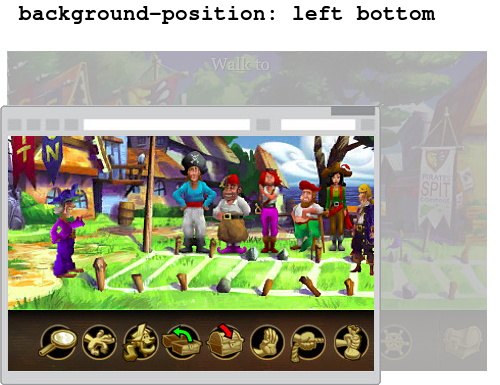
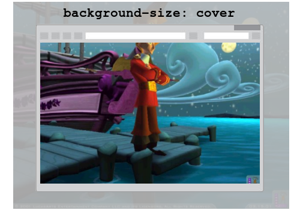
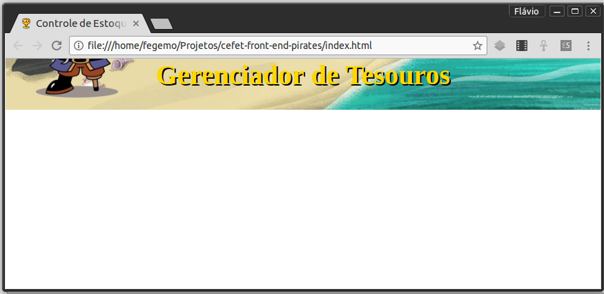

<!-- {"layout": "section-header", "hash": "piratas-e-seus-tesouros"} -->
# Piratas e seus Tesouros 👑
## Ajude Barba-Ruiva!

- Definindo uma imagem de fundo da página
- Ocupando toda a altura do navegador
- Textos sombreados
- Cores semitransparentes

<!-- {ul:.content} -->

<!-- {"backdrop": "piratas"} -->

---
<!-- {"hash": "piratas-instrucoes"} -->
# Gerenciador de Tesouros

1. [Baixe as imagens e o ícone](https://github.com/fegemo/cefet-front-end-pirates/archive/master.zip) que serão usados
1. Descompacte o arquivo `cefet-front-end-pirates-master.zip` na área de trabalho
1. Renomeie a pasta criada na área de trabalho para `tesouro-piratas`
1. **Crie um arquivo `index.html`** na mesma pasta e siga os passos:
   1. Faça a **estrutura básica** e coloque o ícone e a imagem de fundo
   1. Coloque o **título (`h1`) e o parágrafo**, deixando espaço para tabela
      - Estilize-os
   1. **Crie a tabela** e, por fim, estilize-a
   1. Veja [instruções detalhadas aqui](https://github.com/fegemo/cefet-front-end-pirates/blob/master/README.md)

---
<!-- {"hash": "imagem-de-fundo"} -->
# Imagem de fundo

```css
body {
  background-image: url(caminho-para-a-imagem);
  background-repeat: no-repeat;
  background-position: left bottom;
  background-size: cover;
}
```

- `background-image` para escolher que imagem será usada
- `background-repeat: no-repeat` para que a imagem apareça só 1x
- `background-position: left bottom` para fixar que o canto **inferior
  esquerdo** da imagem fique sempre visível
- `background-size: cover` para que a imagem **cubra todo o espaço** da tela

---
## **Ancorando** a imagem **em um canto da tela**




<!-- {p:style="margin-bottom: 0;"} -->

- Deixando um canto da imagem sempre visível com `background-position`
- Outros valores possíveis: `left top`, `center center`, `center bottom` etc.


---
## Ajustando o **tamanho da imagem**




<!-- {p:style="margin-bottom: 0;"} -->

- `background-size: cover`: imagem redimensionada para cobrir todo o espaço
- `background-size: contain`: imagem redimensionada para aparecer completamente

---
<!-- {"hash": "ocupando-toda-altura-navegador"} -->
## Ocupando toda a altura do navegador


---
## Ocupando toda a altura do navegador (cont.)

- **1ª tentativa**: definir a altura do elemento `body` como `100%`:
   <!-- {.push-right style="height: 134px; margin-top: 1em;"} -->
  ```css
  body {
    height: 100%;
  }
  ```
- **Jeito certo**: definir a altura **do elemento `body` <ins>e do
  `html`</ins>** como `100%`:
   <!-- {.push-right style="height: 134px; margin-top: 1em;"} -->

  ```css
  html, body {
    min-height: 100%;
  }
  ```

---
<!-- {"hash": "textos-sombreados"} -->
## Textos <span style="text-shadow: 2px 2px purple; color: hotpink;">sombreados</span>


<!-- {p:style="margin-bottom: 0;"} -->

- Colocar sombras em textos facilita sua leitura quando o texto está sobre uma
  imagem que pode ter muitas cores
  ```css
  h1 {
    text-shadow: 2px 2px black;
  }
  ```

---
<!-- {"hash": "cores-transparentes"} -->
## Cores semitransparentes

- É possível usar cores com transparência, que deixam
  "o que está atrás" aparecer. Por exemplo (em fundo preto para visualizar):
  - ```css
    color: rgba(255, 255, 255, 0.20); /* ou #fff3: branco 20% opaco */
    color: rgba(255, 255, 255, 0.67); /* ou #fffa: branco 67% opaco */
    color: rgba(255, 255, 255, 1);    /* mesmo que white */
    color: rgba(0, 0, 0, 0.53);       /* ou #0008: preto 53% opaco */
    color: rgba(0, 0, 255, 0.53);     /* ou #00f8: azul 53% opaco */
    ```
 - Resultados:

  <p style="color: rgba(255, 255, 255, 0.3); background-color:#black;">branco</p>
  <p style="color: rgba(255, 255, 255, 0.7); background-color:#black;">branco</p>
  <p style="color: rgba(255, 255, 255, 1); background-color:#black;">branco</p>
  <p style="color: rgba(0, 0, 0, 0.5); background-color:#black;">preto</p>
  <p style="color: rgba(0, 0, 255, 0.6); font-style: normal; background-color:#black;">azul</p>

- Podemos usar a notação RGBA(...) ou hexadecimal


---
## Cores semitransparentes

- Também podemos fazer isso com `background-color`:
  - ```css
    p {
      /* preto 50% opaco */
      background-color: rgba(0, 0, 0, 0.5);
      color: white;
    }

    ```
    ```html
    <p>Yarrr Harrr, marujo!!</p>
    ```
    <!-- {li:style="flex-grow: 1;"} -->
    <p style="background-color: rgba(0, 0, 0, 0.5); color: white;">Yarrr Harrr, marujo!!</p>
    <!-- {ul^0:.layout-split-2.no-list-icon.no-padding} -->
    <!-- {li:style="flex-grow: 1;"} -->
    <!-- {ul^1:style="width: 100%;"} -->
    - Repare que o fundo do parágrafo ficou azulado
      - ...porque o fundo da página era azul

