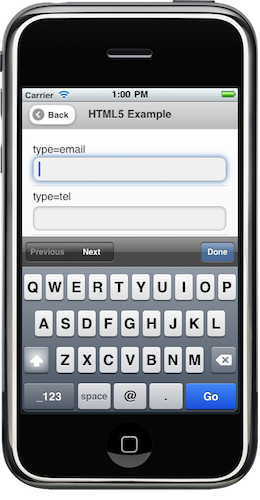
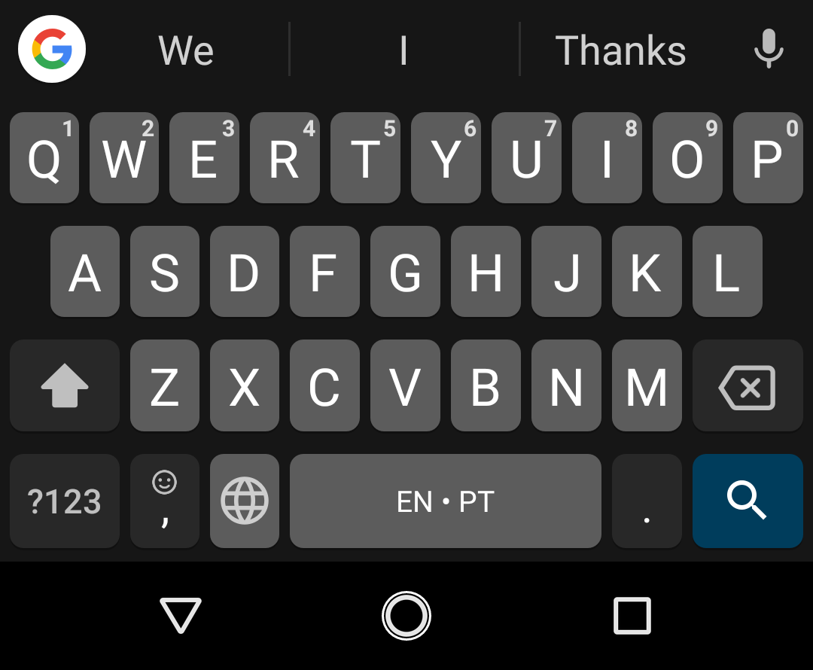
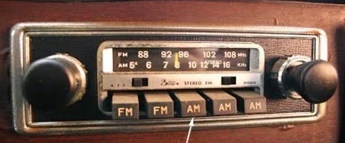

<!-- {"layout": "title"} -->
# **HTML** parte 6

## Elementos HTML de entrada, eventos e formulários<br>e o AvatarCreator 💄

---
# Na última aula... (1/4)

- Objeto Global Window
  ```js
  window.alert('mensagenzinha feia');                     // retorna undefined
  ```
- Objetos dentro do **window**
  - **`window.document`**: Acesso ao DOM (estrutura HTML da página)
  - `window.navigator`: Acesso a características do navegador como geolocalização,
      reconhecimento de fala etc.
  - `window.Math`: **Funções matemáticas**, como `Math.sin`, `Math.floor`, `Math.round`
  - `window.location`: Informações sobre o endereço (a URL) da página
- Convenção: omitir o window

---
# Na última aula... (2/4)

- Alterando a propriedade `style`:
   ```js
   botaoEl.style.width = '80%';           // define largura como 80%
   botaoEl.style.paddingTop = '2px';      // padding-top vira paddingTop
   ```
- CSS ➡️ JavaScript
   - `background-color` ➡️ `backgroundColor` <!-- {ul^0:.multi-column-list-2} -->
   - `border-radius` ➡️ `borderRadius`
   - `margin` ➡️ `margin`

---
# Na última aula... (3/4)

- **click** vs **mousedown** vs **mouseup**
    <iframe width="100%" height="100" src="https://jsfiddle.net/fegemo/xxemf1eq/embedded/result,html,js/" allowfullscreen="allowfullscreen" frameborder="0"></iframe>
- **mouseover** vs **mousemove** vs **mouseout**
  <iframe width="100%" height="200" src="https://jsfiddle.net/fegemo/1eoacrkm/embedded/result,html,js/" allowfullscreen="allowfullscreen" frameborder="0"></iframe>

---
# Na última aula... (4/4)

- Obtendo as posições do mouse por meio das propriedades `e.pageX` e `e.pageY`
<iframe width="100%" height="260" src="https://jsfiddle.net/fegemo/79bnmhp7/embedded/result,js,css/dark/" allowfullscreen="allowfullscreen" frameborder="0" class="bordered"></iframe>

---
<!-- {"layout": "centered"} -->
# Roteiro

1. [Elementos HTML de **entrada**](#elementos-de-entrada)
1. [Elementos HTML de **escolha**](#elementos-de-escolha)
1. [Envio de formulários e validação](#envio-de-formularios-e-validacao)
1. [AvatarCreator](#avatar-creator) 💄

---
<!-- {"layout": "section-header", "hash": "elementos-de-entrada"} -->
# Elementos HTML de **entrada**
## Interação "livre" com usuário

- O elemento `input` e alguns tipos:
  - texto, e-mail, telefone, número, cor
- Rótulos: relembrando o `label`
- O elemento `textarea`
- Interagindo via JavaScript
<!-- {ul^1:.content} -->

---
## Caixa de texto <small>(p/ usuário digitar)</small>

- Elemento HTML onde o usuário pode digitar qualquer coisa
- Formato:
  ```html
  <input id="palavra" type="text" placeholder="Digite..."> <!-- exemplo abaixo -->
  <input id="palavra">
  <input>
  ```
  - `type="text"` é o valor padrão para o `input`
  - `placeholder="um texto..."` define um texto de ajuda que só aparece
    quando não há nada digitado
  ::: result
  <input type="text" placeholder="Digite...">
  :::

---
## Rótulos <small>(ou etiquetas)</small>

- Tipicamente atribuímos rótulos (`<label></label>`) aos campos (`input`)
  - Podemos clicar nos rótulos e o foco será movido para dentro do `input`
    a ele associado
  - Há 02 formas de associação:
    ```html
    <label for="cidade">Cidade: </label><input id="cidade">
    <!-- ...ou... -->
    <label>Cidade:
        <input id="cidade">
    </label>
    ```
    ::: result
      <div><label>Cidade: <input id="cidade"></label></div>
    :::

---
<!-- {"layout": "tall-figure-right"} -->
## Caixa de texto para **e-mail**  <!-- {style="max-height: .75em"} -->

 <!-- {p:.centered} -->

- Idêntico à caixa de texto, porém o navegador espera um e-mail válido
- Formato:
  ```html
  <label>Remetente:
    <input id="remetente" type="email">
  </label>
  ```
  - Em _smartphones_, os navegadores mudam o _layout_ do teclado colocando
    "@" em posições mais fáceis
::: result
<div><label>Remetente:
  <input id="remetente" type="email">
</label></div>
:::

---
## Outros semelhantes à caixa de texto  <!-- {style="max-height: .75em"} -->

- Pesquisa<br> <!-- {ul:style="display: flex; flex-direction: row; justify-content: space-around"} -->
  `<input type="search">`: <input type="search" style="width: calc(100% - 1em); box-sizing: border-box; margin-bottom: 1em;">
   <!-- {style="width: calc(100% - 1em)"} -->
- URL<br>
  `<input type="url">`: <input type="url" style="width: calc(100% - 1em); box-sizing: border-box; margin-bottom: 1em;">
   <!-- {style="width: calc(100% - 1em)"} -->
- Telefone<br>
  `<input type="tel">`: <input type="tel" style="width: calc(100% - 1em); box-sizing: border-box; margin-bottom: 1em;">
     <!-- {style="width: calc(100% - 1em)"} -->


---
<!-- {"layout": "2-column-content"} -->
## Números, Escala e Cor  <!-- {style="max-height: .75em"} -->

- Formato: <!-- {ul:.no-bullets.no-padding} -->
  ```html
  <input type="number" step="0.5">
  <input type="range" min="0" max="100" step="1">
  <input type="color">
  ```
1. <!-- {ol:.no-bullets.no-padding} -->
   ::: result . background-color:white; margin-top: 1.25em
   1. <input type="number" step="0.5" size="4"><br>
   2. <input type="range" min="0" max="100" step="1"><br>
   3. <input type="color">
   :::

- `number` é indicado para digitação de um número específico <!-- {ul:.span-columns} -->
- `range` para uma escala (_e.g._, quente ou frio?)
  - `number` e `range` aceitam `min`, `max` e `step` (incremento)
- `color` para pegar o valor hexadecimal de uma cor

---
<!-- {"layout": "2-column-content"} -->
## Data e Hora  <!-- {style="max-height: .75em"} -->

- Formato: <!-- {ul:.no-bullets.no-padding} -->
  ```html
  <input type="date">
  <input type="time">
  <input type="datetime-local">
  <input type="month">
  <input type="week">
  ```

::: result . display: flex; flex-direction: column; margin-top: 2.25em;
<input type="date">
<input type="time">
<input type="datetime-local">
<input type="month">
<input type="week">
:::

- Observações: <!-- {ul:.span-columns} -->
  - `date` é apenas uma data, `time` apenas um horário
  - `datetime-local` é um dia/horário

---
## Interagindo via JavaScript

- Todo `<input>` possui o **atributo `value`**, que é o **valor <u>padrão</u>**.
  Exemplo:
  - `<input type="number" value="5">`: <input id="qtde-pizzas" type="number" value="5" style="width: 3em;">
    <button onclick="alert(document.querySelector('#qtde-pizzas').value)">(1) Pegar</button>
    <button onclick="document.querySelector('#qtde-pizzas').value = 25">(2) Definir</button>
- Para pegar (_get_) ou definir (_set_) o
  **valor <u>atual</u>** <!-- {.alternate-color} --> via JavaScript, (a) pegamos
  o elemento no DOM e (b) acessamos a
  **propriedade `value`**: <!-- {.alternate-color} -->
  ```js
  let quantidadePizzasEl = document.querySelector('#qtde-pizzas');


  // podemos pegar o valor atual no console acessando .value:
  let qtdePizzasAtual = quantidadePizzasEl.value; // botão 1
  alert(qtdePizzasAtual);


  // ou podemos definir um novo valor para o elemento:
  quantidadePizzasEl.value = 25;                  // botão 2
  ```

<!-- {li:.compact-code} -->

---
<!-- {"layout": "section-header", "hash": "elementos-de-escolha"} -->
# Elementos HTML de **escolha**
## Pegando a escolha do usuário

- O `input` do tipo `checkbox`
- O `input` do tipo `radio`
- O elemento `select` e suas `option`s
- Interação via JavaScript
<!-- {ul:.content} -->

---
## Checkbox: <small>caixinha de marcação</small>

- Formato:
  ```html
  <label>
    <input id="emails" type="checkbox" value="sim"> Inscrever?
  </label>
  ```
  - **!!** Se não colocarmos um `<label></label>`, o usuário precisará
    clicar exatamente na caixinha
    ::: result
      <div style="display: flex; justify-content: space-between"><label>
        <input type="checkbox"> Inscrever (com label)?
      </label><div><input type="checkbox"> Inscrever <del>(com label)</del>?</div></div>
    :::
- Atributos:
  - `checked`, para deixar **previamente marcado**
    ```html
    <input id="..." type="checkbox" checked>
    ```

---
<!-- {"layout": "2-column-content"} -->
## Radio: <small>escolha dentro de um grupo</small>

- Formato: <!-- {ul:.no-margin} -->
  ```html
  <label>
    <input type="radio" name="cor" value="azul">Azul
  </label>
  <label>
    <input type="radio" name="cor" value="verde">Verde
  </label>
  ```
1.  <!-- {style="max-width: 80%; margin-top: 1.5em;"} --> <!-- {ol:.no-bullets.no-padding.center-aligned.no-margin} -->
   ::: result
     <div><label>
       <input type="radio" name="cor" value="azul"> Azul
     </label>
     <label>
       <input type="radio" name="cor" value="verde"> Verde
     </label></div>
   :::

- **Atributo `name`**: define qual é o nome do input ao enviar o fomulário para o servidor <!-- {ul:.span-columns} -->
- Repare que apenas uma cor pode ser escolhida
  - porque **os dois `<input>` têm o mesmo `name`** <!-- {strong:.alternate-color} -->

---
## Select e options <small>(lista de opções)</small>

- ::: result .push-right margin-left: 1em; margin-top: 1.25em
  <label for="sabor" style="display: block">Sabor da pizza:</label> <select name="sabor" id="sabor">
    <option value="marg">Marguerita</option>
    <option value="muzza" selected>Frango</option>
  </select>
  :::
  Formato: <!-- {ul:.full-width.no-margin} -->
  ```html
  <label for="sabor">Sabor da pizza:</label>
  <select id="sabor">
    <option value="marg">Marguerita</option>
    <option value="muzza" selected>Frango</option>
  </select>
  ```
- Atributos:
  - `selected`, para o `option`, para deixar selecionado
  - `multiple`, para o `select`, para permitir mais de um `option`

---
<!-- {"classes": "compact-code"} -->
## Interagindo via JavaScript (2)

1. Verificando se um `checkbox` está marcado: <label><input type="checkbox" id="inscrever"> Inscrever?</label> <button onclick="alert(document.querySelector('#inscrever').checked)">💻 Executar</button>
   ```js
   let desejaInscreverEl = document.querySelector('#inscrever');
   let estaMarcado = desejaInscreverEl.checked;   // elemento.checked: true/false
   ```
1. Pegando qual opção selecionada em um `select`: <select id="pizza"><option value="marg">Marguerita</option><option value="muzza" selected>Muzzarela</option></select> <button onclick="alert(document.querySelector('#pizza').value)">💻</button>
   ```js
   let saborPizzaEl = document.querySelector('#pizza');
   let sabor = saborPizzaEl.value;   // elementoSelect.value: valor da option
   ```
1. Pegando qual a opção marcada em um grupo de `radio`: <label><input type="radio" name="cor" value="azul"> Azul</label><label><input type="radio" name="cor" value="verde"> Verde</label> <button onclick="alert(document.querySelector('[name=cor]:checked').value)">💻</button>
   ```js
   let corMarcadaEl = document.querySelector('[name="cor"]:checked');
   let cor = corMarcadaEl.value;   // elemento.value: valor do input
   ```
   - Repare o **seletor**<!--{.alternate-color}-->: todo elemento com
     **atributo `name="cor"`** e que **esteja no estado `:checked`** (marcado) <!-- {ol:.bulleted-0} -->

---
<!-- {"layout": "centered-horizontal"} -->
## Outros elementos de dados

| Tipo               	| Markup                  	| Exemplo                 	|
|--------------------	|-------------------------	|-------------------------	|
| Seleção de arquivo 	| `<input type="file">`     | <input type="file" style="font-size: .5em">   	|
| Campo de senha     	| `<input type="password">`	| <input type="password"> 	|
| Texto oculto       	| `<input type="hidden">`	  |                          	|
| Texto multi-linha   | `<textarea></textarea>`   | <textarea></textarea>     |

---
<!-- {"layout": "section-header", "hash": "envio-de-formularios-e-validacao"} -->
# Envio de Formulários e Validação
## Enviando dados e verificando

- O elemento HTML **`<form></form>`** <!-- {ul:.content} -->
- Botões: _submit_, _reset_ e _button_
- Validação de campos e formulário

---
## O Elemento HTML `<form>...</form>`

- Um **formulário** é um conjunto de campos de dados (_i.e._, entrada/escolha)
  que pode ser **enviado** <!-- {.underline} --> a um servidor Web. Exemplos:
  -  <!-- {.push-right.bordered.rounded style="max-width: 450px"} -->
    Ao se cadastrar no Facebook (ou qualquer site)
  - Ao preencher e enviar um questionário
  - Ao editar seu perfil em algum site
- Além de **enviar os dados**, podemos também configurar os campos com
  algumas **restrições** (_e.g._, campo obrigatório)

---
## Formulário e Botões

- Um _form_ agrupa _inputs_ para, posteriormente, serem enviados a
  um servidor (por exemplo, para **cadastrar um usuário**):
  ```html
  <form action="cadastrar-usuario.php"> <!-- que "página" receberá os dados -->
    <label>Nome: <input name="nome" type="text"></label>
    <label>E-mail: <input name="email" type="email"></label>
    <label>Senha: <input name="senha" type="password"></label>

    <button type="submit">Enviar</button> <!-- veja no próximo -->
    <button type="reset">Limpar</button>  <!-- slide -->
  </form>
  ```
- Exemplo de [formulário](../../samples/form/index.html) <!-- {target="_blank"} -->

---
## Botões de submissão e _reset_

- Dentro de um formulário, um botão do `type="submit"` envia os dados para
  o servidor: <button type="submit">Cadastrar</button>
  ```html
  <button type="submit">
    Cadastrar <!-- podemos colocar ícones nos botões =) -->
  </button>
  ```
- Um botão `type="reset"` volta os valores digitados para
  seus `value` padrão
  ```html
  <button type="reset">Limpar</button> <!-- muito pouco usado -->
  ```
- Também há botões que não fazem nada, mas podem ter algum comportamento
  associado (via JavaScript)
  ```html
  <button type="button">Ver detalhes</button> <!-- type="button" é o padrão -->
  ```

---
## Validação e Restrições nos Campos

- Podemos usar o atributo HTML `required` para marcar um campo como
  de preenchimento obrigatório:
  ```html
  <form action="verifica-login.php">
    <label>Digite seu login:
      <input type="text" id="usuario" required>
      <input type="password" id="senha" required>
    </label>
    <button type="submit">Entrar</button>
  </form>
  ```
  ::: result
  <form action="verifica-login.php">
    <label>Digite seu login:
      <input type="text" id="usuario" required size="10">
      <input type="password" id="senha" required size="10">
    </label>
    <button type="submit">Entrar</button>
  </form>
  :::

---
## Outros Tipos de Restrições

| Tipo      	            | Código HTML                  	        | Exemplo                 	                   |
|-------------------------|---------------------------------------|--------------------------------------------- |
| Campo obrigatório 	    | `<input required>`                    | <form><input required size="5"><button>Enviar</button></form>     	|
| Quantidade de caracteres| `<input maxlength="2">`	              | <input maxlength="2" size="5"> 	|
| Número mínimo       	  | `<input type="number" min="5">`	      | <form><input type="number" min="5" style="width: 5em"><button>Enviar</button></form>	|
| Número máximo       	  | `<input type="number" max="10">`	    | <form><input type="number" max="10" style="width: 5em"><button>Enviar</button></form>	|
| Padrão                  | `<input pattern="[0-9]{4}">` | <form><input pattern="[0-9]{4}" size="5"><button>Enviar</button></form>     |
| Desabilitar             | `<input disabled>` | <input disabled size="5">     |

---
<!-- {"layout": "section-header", "hash": "avatar-creator"} -->
# AvatarCreator :lipstick:
## Gerador de avatares

- O AvatarCreator :lipstick:
- Eventos de formulários
  - Foco: `blur` e `focus`
  - Teclado: `keydown` e `keyup`
  - Modificação: `change`, `input`<!-- {ul^1:.content} -->
- Estilizando campos de formulários

---
<!-- {"backdrop": "avatarcreator"} -->

---
# Atividade de Hoje

- Completar a página do "AvatarCreator" :lipstick:
- [Baixe os arquivos][avatar-seminal] contendo o HTML e faça os exercícios
  - Leia as instruções detalhadas no arquivo `README.md`. No geral:
    1. Possibilitar o usuário:
       - Escrever o nome
       - Selecionar uma cor da pele
       - Escolher um cabelo
       - Colocar/remover acessórios (desafios)

[avatar-seminal]: https://github.com/fegemo/cefet-front-end-avatar/archive/master.zip

---
# Eventos de formulários

- Lembrando: eventos são **associados a elementos HTML** e causam a
  invocação de uma função "manipuladora" (_event handler_)
- Eventos de entrada de dados:
  - `change` ou `input` (modificou)
  - `blur` (perdeu foco)
  - `focus` (ganhou foco)
  - `keydown` (pressionou uma tecla)
  - `keyup` (liberou uma tecla)<!-- {ul:.multi-column-list-2}-->
- <iframe width="700" height="170" src="//jsfiddle.net/fegemo/novwcd56/embedded/result,js/" allowfullscreen="allowfullscreen" allowpaymentrequest frameborder="0" class="push-right bordered rounded"></iframe>
  (Muitos) outros tipos: <a href="https://developer.mozilla.org/en-US/docs/Web/Events" target="_blank">Eventos na MDN</a>

---
## Estilizando campos de formulários

- Campos de "entrada livre" (`text`, `number`, `email` etc.) podem ser
  facilmente estilizados. Exemplos: <!-- {ul:.compact-code-more} -->
  ```css
  input[type="number"] {  /* todos os campos de números */
    width: 4em; /* largura de 4 caracteres */
  }

  input[disabled],    /* todos que estejam disabled */
  button[disabled] {
    cursor: not-allowed;
    opacity: 0.65;
  }

  input.discreto {    /* criei uma classe */
    background-color: transparent;
    border-width: none; /* tira o fundo e a borda */
  }
  ```
  ::: result
  <input type="number" style="width: 4em;">
  <input type="text" disabled style="cursor: not-allowed; opacity: 0.65">
  <button disabled style="cursor: not-allowed; opacity: 0.65">Desabilitado</button>
  <input class="discreto" type="texto" style="background-color: transparent; border-width: 0;">
  :::


---
<!-- {"embeddedStyles": ".estilizando-forms input:focus { outline: 3px solid yellow !important; } .estilizando-forms input:invalid { border: 1px solid red; }"} -->
## Estilizando campos em diferentes estados

- É possível estilizar campos **em diferentes situações** <!-- {ul:.estilizando-forms} -->
  ```css
  input:focus { /* elemento que está com o foco */
    outline: 3px solid yellow;
  }
  input:invalid { /* elementos com erro */
    border: 1px solid red;
  }
  ```
  ::: result
  <input type="number" required placeholder="Este number é required">
  <input type="text" pattern="[0-9]{4}" maxlength="4" size="20" placeholder="Padrão de 4 dígitos">
  :::
  - É importante ressaltar o elemento que **está com o foco**
  - Além de mostrar os que **estão com erro**


---
<!-- {"layout": "centered"} -->
# Referências

1. Capítulo _"A Form of Madness"_ do livro online diveintohtml5.info
1. Capítulo 14 do livro
1. Mozilla Developer Network (MDN)
