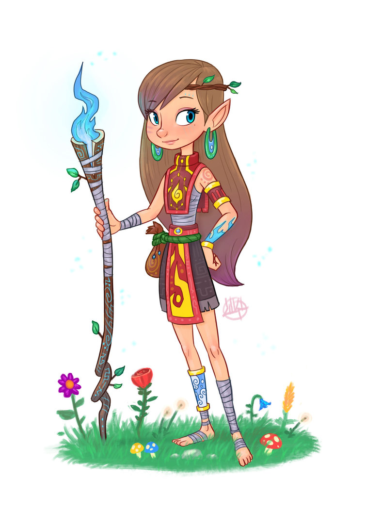
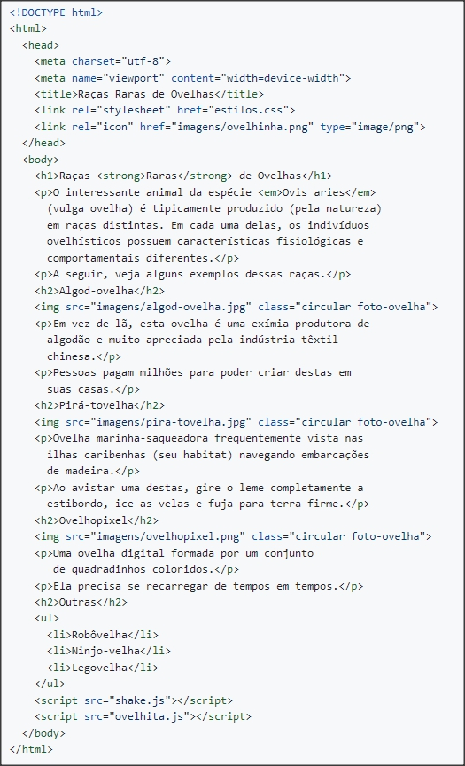
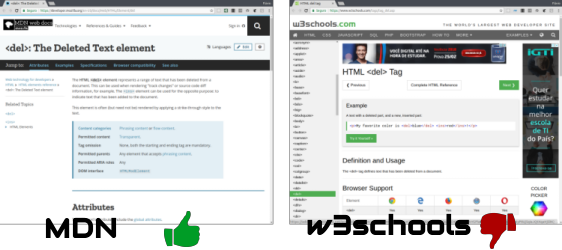

<!-- {"layout": "section-header", "hash": "minha-primeira-pagina-web"} -->
# Minha Primeira Página Web
## Como cria-las, o que elas comem, seu habitat etc.

- Ferramentas necessárias
- Um arquivo HTML
<!-- {ul:.content} -->

---
<!-- {"layout": "tall-figure-right"} -->
## Ferramentas Necessárias


- O **KIT AVENTUREIRO** deve conter:

  01 editor de texto <!-- {dl:.width-50.bulleted-dt} -->
    - Pode ser o **bloco de notas** mesmo ;)
    - Mas existem outras ferramentas

  01 navegador web
    - **Chrome**, Firefox, Edge, Safari, Opera
    - Mas existem outras ferramentas

  --salgadinhos--
    - fim!

---
# Atividade Prática <small>(1/4)</small>

**Enunciado**
  - Você vai recriar a página das raças raras de ovelhas.
  - Para isso, você deve baixar [este arquivo compactado][codigo-seminal-ovelhas]
    que contém as imagens, um arquivo CSS e dois arquivos JavaScript.
  - Leia os 4 slides da atividade <u>antes de começar</u>!

**Pré-Atividade**
  - 1. **Baixe** e **descompacte** os arquivos em uma pasta (e.g.,
       "Documentos/Ovelhas")
    1. Abra o bloco de notas e, com ele vazio,
       salve um novo arquivo, nessa pasta, com o nome `racas-raras.html`

[codigo-seminal-ovelhas]: https://github.com/willsallum/cefet_front_end/classes/intro/tarefa/main.zip

---
<!-- {"preventSelection": "pre > code", "elementStyles": {"pre": "height: 160px"} } -->
# Atividade Prática <small>(2/4)</small>

- **Atividade 1**
  - Digite o conteúdo do arquivo `racas-raras.html` no editor de texto: <!-- {.compact-code} -->
  <!--
    ```html
    <!DOCTYPE html>
    <html>
      <head>
        <meta charset="utf-8">
        <meta name="viewport" content="width=device-width">
        <title>Raças Raras de Ovelhas</title>
        <link rel="stylesheet" href="estilos.css">
        <link rel="icon" href="imagens/ovelhinha.png" type="image/png">
      </head>
      <body>
        <h1>Raças <strong>Raras</strong> de Ovelhas</h1>
        <p>O interessante animal da espécie <em>Ovis aries</em>
          (vulga ovelha) é tipicamente produzido (pela natureza)
          em raças distintas. Em cada uma delas, os indivíduos
          ovelhísticos possuem características fisiológicas e
          comportamentais diferentes.</p>
        <p>A seguir, veja alguns exemplos dessas raças.</p>
        <h2>Algod-ovelha</h2>
        
        <p>Em vez de lã, esta ovelha é uma exímia produtora de
          algodão e muito apreciada pela indústria têxtil
          chinesa.</p>
        <p>Pessoas pagam milhões para poder criar destas em
          suas casas.</p>
        <h2>Pirá-tovelha</h2>
        
        <p>Ovelha marinha-saqueadora frequentemente vista nas
          ilhas caribenhas (seu habitat) navegando embarcações
          de madeira.</p>
        <p>Ao avistar uma destas, gire o leme completamente a
          estibordo, ice as velas e fuja para terra firme.</p>
        <h2>Ovelhopixel</h2>
        
        <p>Uma ovelha digital formada por um conjunto
           de quadradinhos coloridos.</p>
        <p>Ela precisa se recarregar de tempos em tempos.</p>
        <h2>Outras</h2>
        <ul>
          <li>Robôvelha</li>
          <li>Ninjo-velha</li>
          <li>Legovelha</li>
        </ul>
        <script src="shake.js"></script>
        <script src="ovelhita.js"></script>
      </body>
    </html>
    ```
    -->
    
    - Repare que não é possível copiar/colar
- **Testando**
  - De tempos em tempos, **<u>abra o arquivo</u> no navegador** (_e.g._,
    dando dois cliques nele) para ver como está ficando

---
# Atividade Prática <small>(3/4)</small>

**Atividade 2**
  - Depois de copiado o código, você deve testar algumas _tags_, como:
    - `O <del>interessante</del> surpreendente animal`
  - Altere o conteúdo dentro do `<body>` usando as seguintes _tags_: `del`,
    `em`, `ins` e `mark`. Veja o que ocorre e entenda o funcionamento de
    cada uma _tag_ usada

---
# Atividade Prática <small>(4/4)</small>

**Pesquisando**
  - Pesquise na Web (_e.g._, [Google] [google], [Bing] [bing]) sobre essas _tags_,
    tipo assim: "html tag del" (sem as áspas)

     <!-- {.push-right style="height: 125px"} -->

      Prefira sempre a página MDN (informação confiável, completa e sem propagandas)

>[!IMPORTANT]
>**Entrega**
>  - Você deve **mostrar ao professor** o seu exercício para ganhar o visto.
>  - Além disso, caso seja determinado pelo professor, você deve compactar a pasta com todos os seus arquivos em um arquivo `.zip` e então **enviar esse arquivo via [Moodle] [moodle]**

*[MDN]: Mozilla Developer Network*
[google]: http://google.com
[bing]: http://bing.com
[moodle]: http://ava.cefetmg.br
