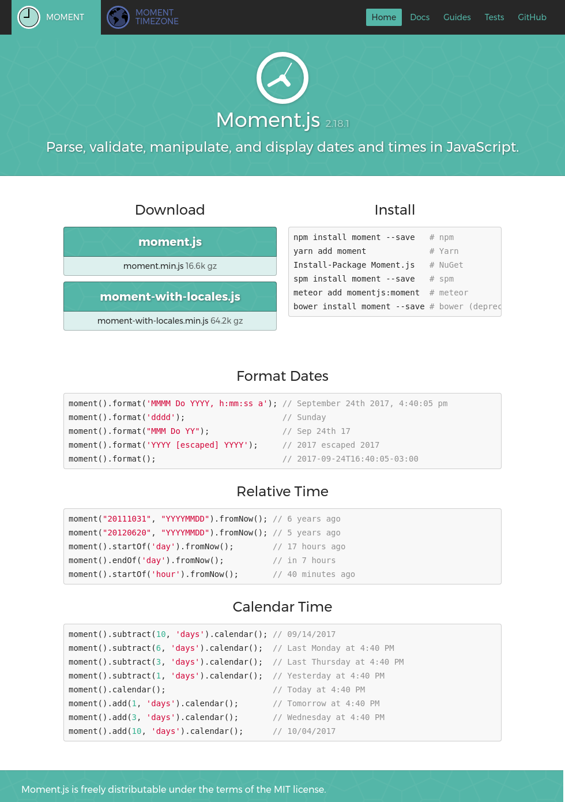
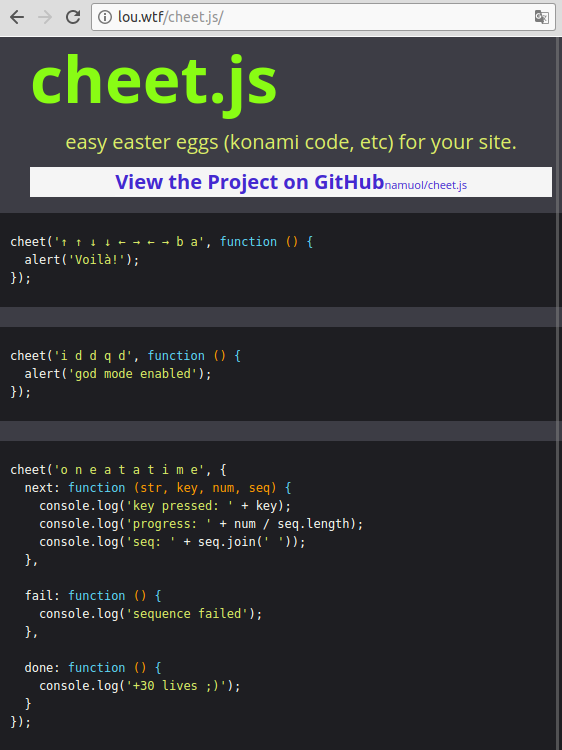
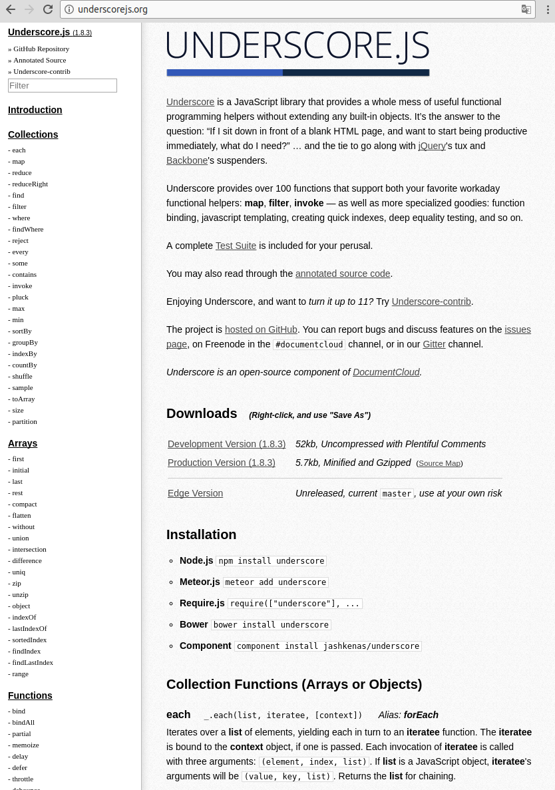

<!-- {"layout": "title"} -->
# **JavaScript** parte 6
## Bibliotecas JavaScript e jQuery

---
<!-- {"classes": "compact-code"} -->
# Na última aula... (1/2) <!-- {h1:style="padding: 0; margin-bottom: 0.15em"} -->
## **Web Storage**: `localStorage` + `sessionStorage`

- Ambos nos permitem **armazenar valores dentro de _Strings_**
- Cada item armazenado é composto por **uma chave (nome) e um valor**
  - Exemplo (salvando):
    ```js
    window.localStorage.setItem('personagem', 'Jake');          // pra sempre
    window.sessionStorage.setItem('quest', 'Salvar a Jujuba');  // temporariam.
    ```
    - Lembre-se: ~~`window.`~~`localStorage` e ~~`window.`~~`sessionStorage`
  - Exemplo (recuperando):
    ```js
    let nome = localStorage.getItem('personagem');    // retorna "Jake"
    let objetivo = sessionStorage.getItem('quest');   // retorna "Salvar a Jujuba"
    ```

---
# Na última aula... (2/2) <!-- {h1:style="padding: 0; margin-bottom: 0.15em"} -->
## **JSON** no navegador

- O objeto `window` possui o objeto `JSON` que contém métodos de conversão
  do formato JSON entre _string_ e objetos JavaScript
  - De JavaScript para _string_ (serialização):
    ```js
    JSON.stringify({ nome: 'Flavio', sobrenome: 'Coutinho' });
    // retorna '{"nome":"Flavio","sobrenome":"Coutinho"}' (uma string)
    ```
  - De _string_ para JavaScript (desserialização):
    ```js
    let banco = JSON.parse('{"nome":"Itaú","codigo":"341"}');
    console.log(banco.nome);          // imprime Itaú
    ```

---
<!-- {"layout": "centered"} -->
# Roteiro

1. [Bibliotecas JavaScript](#bibliotecas-javascript)
1. [jQuery](#jquery)
   - [Funcionamento básico e seletores](#jquery-funcionamento-basico)
   - [Atribuindo eventos](#jquery-atribuindo-eventos)
   - [Estilizando elementos](#jquery-estilizando-elementos)
   - [Efeitos visuais](#jquery-efeitos-visuais)

---
<!-- {"layout": "section-header", "hash": "bibliotecas-javascript"} -->
# **Bibliotecas** JavaScript
## Usando código **reutilizável**

- O que são e como usar
- Exemplos:

  moment.js
    ~ lidando com datas

  cheet.js
    ~ criando _easter eggs_

  underscore.js
    ~ trabalhando com vetores

<!-- {ul:.content} -->

---
## Bibliotecas JavaScript

- São códigos reutilizáveis em vários contextos
- Surgiram inicialmente para:
  1. Amenizar os problemas de **compatibilidade entre navegadores**
     - Exemplos: Prototype, MooTools, YUI, <u>jQuery</u>
  1. Tornar o uso da linguagem mais **agradável**
     - Exemplos: <u>underscore</u>, lodash
- Outros objetivos:
  1. **Consertar problemas** na linguagem
     - Exemplos: <u>moment.js</u>, RequireJS, Browserify
  1. Coisas variadas
     - Exemplos: criar gráficos, criar jogos, <u>criar _easter eggs_</u>,
       criar slides etc

---
## Como usar uma biblioteca?

- Tipicamente, o criador disponibiliza **01 arquivo `.js` que você deve
  incluir** em suas páginas <!-- {ul:.compact-code} -->
  - Podemos, então, usar as funções/objetos globais da biblioteca
    nos nossos arquivos `.js`
- Basicamente:
  1. Entrar na página da biblioteca
  1. Ler as instruções para incluí-la. Normalmente:
     ```html
       ...
       <script src="biblioteca.js"></script> <!-- ⬅️ -->
       <script src="meu-proprio-codigo.js"></script>
     </body>
     </html>
     ```
  1. Ler a documentação das funções da biblioteca

---
<!-- {"layout": "2-column-highlight-and-content", "classes": "compact-code"} -->
## Exemplo: [moment.js](https://momentjs.com/)

 <!-- {p:style="margin: auto 0 auto auto"} --> <!-- {style="max-width: initial; width: 400px"} -->

- Objetivo: trabalhar facilmente com datas. Por exemplo:
  - Operações com datas:
    ```js
    let agora = moment();
    let entrega = agora.add(7, 'days');
    ```
  - Escrever "quanto tempo se passou":
    ```js
    let apollo11 = moment('20071969',
                              'DDMMYYYY');
    let quantoTempo = apollo11.fromNow();
    alert('Alunamos há: ' + quantoTempo);
                          // 48 years ago
    ```

---
<!-- {"layout": "2-column-highlight-and-content"} -->
## Exemplo: [cheet.js](http://lou.wtf/cheet.js/)

 <!-- {p:style="margin: auto 0 auto auto"} --> <!-- {style="max-width: initial; width: 400px"} -->

- Objetivo: criar [_easter eggs_][easter-eggs] em uma página web
  ```js
  let dinheiro = 100;
  let somDeSucesso = document
                   .createElement('audio');
  somDeSucesso.src = 'blip.mp3';

  cheet('⬆️ ⬆️ ⬇️ ⬇️ ⬅️ ➡️ ⬅️ ➡️ b a', function() {
    dinheiro += 1000;
    somDeSucesso.play();
  });
  ```

[easter-eggs]: https://pt.wikipedia.org/wiki/Ovo_de_p%C3%A1scoa_(virtual)

---
<!-- {"layout": "2-column-highlight-and-content", "classes": "compact-code-more"} -->
## Exemplo: [underscore.js](http://underscorejs.org/)

 <!-- {p:style="margin: auto 0 auto auto"} --> <!-- {style="max-width: initial; width: 400px"} -->

- Objetivo: facilidades para trabalhar com vetores etc.
- Exemplo: (a) achatar vetores e (b) embaralhar cartas
  ```js
  let naipeOuro = ['♦️ás', '♦️2', ... '♦️rei'];
  let naipePaus = ...
  ...
  let baralho = [naipeOuro, naipePaus, naipeEspada, naipeCopas];
  baralho = _.flatten(baralho);   // (a) "achatou" os vetores
  baralho = _.shuffle(baralho);   // (b) embaralhou as cartas
  ```
  - **Nota**: o arquivo `underscore.js` expõe um único objeto: o `window._`

---
<!-- {"layout": "section-header", "hash": "jquery"} -->
# jQuery
## A biblioteca jQuery

- Funcionamento básico e seletores
- Atribuindo eventos
- Estilizando elementos
- Efeitos visuais
<!-- {ul:.content} -->

---
## A biblioteca jQuery

 <!-- {.push-right.small-width.invert-colors-dark-mode} -->
  
Criada em 2006 por John Resig
  - Pronuncia-se djeiquíulri
- Objetivos:
  1. Resolver **incompatibilidade entre navegadores**
  1. Aumentar **expressividade do código**
  1. **Simplificar interfaces** complexas
  1. Implementar **funções corriqueiras**
- Chegou a ser **usada** por quase **<u>75% de toda a Web</u>**

---
<!-- {"hash": "incluindo-a-biblioteca-jquery"} -->
## Incluindo a biblioteca jQuery

- Em uma página, você deve incluir o arquivo `jquery.js`. Há 2 formas: <!-- {ul:.compact-code} -->
  1. Baixando o arquivo `jquery.js` e colocando-o com o seu projeto:
     ```html
       <script src="js/jquery.js"></script>
       <script src="js/meu-proprio-codigo.js"></script>
     </body>
     </html>
     ```
  1. Usando o `jquery.js` hospedado em uma CDN (_i.e._, na nuvem)
     - CDN é uma rede de computadores para hospedar arquivos para sites
       ```html
         <script src="http://algumacdn.com.br/jquery.js"></script>
         <script src="js/meu-proprio-codigo.js"></script>
       </body>
       </html>
       ```

*[CDN]: Content Delivery Network*

---
## Objeto/função exposta por `jquery.js`

- O `jquery.js` disponibiliza apenas 1 objeto/função, que possui
  toda a funcionalidade da biblioteca:
  ```js
  window.jQuery = $ = function(seletor) {
    // ... zilhão de funções úteis aqui
  }
  ```
  - Repare que `$` é um nome válido para uma variável em JavaScript, e é
    exatamente a variável que expõe a "função jQuery"
  - A função `$` (jQuery) recebe uma **string com um seletor CSS**, igual a
    `document.querySelectorAll`

---
<!-- {"hash": "jquery-funcionamento-basico", "classes": "two-column-code compact-code-more"} -->
## Funcionamento básico e seletores (1/3)

- Com jQuery, praticamente tudo é feito **em 2 passos**:
  1. **Seleciona-se** um ou mais elementos
  1. **Executa-se** alguma lógica com eles
- Exemplo: alterando o conteúdo HTML de um elemento usando jQuery e
  em "vanilla JavaScript":

```js
// Usando jQuery
$('#pokemon').html('Pikachu');

// $('#pokemon') == jQuery('#pokemon')
// Em "vanilla js" (js puro)
let el = document.querySelector('#pokemon');
el.innerHTML = 'Pikachu';
```

---
## Funcionamento básico e seletores (2/3)

- Passamos um seletor CSS para a função `$`
  - Veja a [documentação][doc-jquery-fn] da função `$` (ou função jQuery)
  - Ela retorna um **"objeto jQuery"**, que é uma coleção de elementos HTML
- Um **objeto jQuery** possui vários métodos e eles <u>atuam na coleção
  inteira</u>:
  ```js
  $('p').html('It\'s me, Maaaario!');
  // alterou o innerHTML de TODOS os parágrafos da página
  ```
  - **Experimento**: vá para a página do jQuery e execute essa linha!

[doc-jquery-fn]: https://api.jquery.com/jQuery/#jQuery-selector-context

---
<!-- {"embeddedStyles": ".not-centered-pres pre { margin: 0!important; }", "classes": "compact-code-more"} -->
## Funcionamento básico e seletores (3/3)

- Exemplo: na prática da **exploração espacial** (botões '+'/'-') <!-- {ul:.no-padding.no-bullets} -->
<!-- {li:.layout-split-2.compact-code-mid.not-centered-pres} -->
  ```js
  // versão jQuery
  $('button').click((e) => {
    let $p = $(e.currentTarget).closest('p');
    $p.toggleClass('expandido');
    $p.html($p.hasClass('expandido') ? '-' : '+');
  });
  ```
  ```js
  // versão "vanilla js"
  let botoes = document.querySelectorAll('button');
  for (let bEl of botoes) {
    bEl.addEventListener('click', (e) => {
      let pEl = e.currentTarget.parentNode;
      let colocou = pEl.classList.toggle('expandido');
      e.currentTarget.innerHTML = colocou ? '-' : '+';
    });
  }
  ```

---
<!-- {"hash": "jquery-atribuindo-eventos", "classes": "compact-code-more"} -->
## Atribuindo eventos

- Usando jQuery, há atalhos para **colocar eventos** em elementos ou
  **em coleções deles (objeto jQuery)**
<!-- {li:.code-split-2} -->
  ```js
  $('.ajuda').click(ajuda);


  ```
  ```js
  document.querySelectorAll('.ajuda')
    .forEach(el =>
      el.addEventListener('click', ajuda);
    );
  ```
- Outros eventos:
  ```js
  $colecao.click(callback);                   // addEventListener('click', callback)
  $colecao.mousemove(callback);               // 'mousemove'
  $colecao.keyup(callback);                   // 'keyup'
  $colecao.change(callback);                  // 'change' (no input)
  $colecao.hover(callbackOver, callbackOut);
  ```

---
<!-- {"hash": "jquery-estilizando-elementos"} -->
## Estilizando elementos

- **Objetos jQuery** podem ser estilizados, como em "vanilla js", usando:
  - (a) classes:
<!-- {li:.code-split-2} -->
    ```js
    $('#tutorial').toggleClass('big');

    ```
    ```js
    document.querySelector('#tutorial')
          .classList.toggle('big');
    ```
  - (b) propriedades CSS diretamente:
<!-- {li:.code-split-2} -->
    ```js
    $('#tutorial').css('width', '50px');

    ```
    ```js
    document.querySelector('#tutorial')
          .style.width = '50px';
    ```
- Veja a descrição da [função `.css(prop, valor)`][doc-jquery-css] na
  documentação

[doc-jquery-css]: http://api.jquery.com/css/#css2

---
<!-- {"hash": "jquery-efeitos-visuais"} -->
## Efeitos visuais

- Algumas funções para fazer efeitos visuais: <!-- {ul:.compact-code} -->
  ```js
  $colecao.fadeIn();        // faz elementos surgirem com opacity [0, 1]
  $colecao.fadeOut();       // faz elementos desaparecerem [1, 0]
  $colecao.fadeToggle();    // alterna fadeIn()/fadeOut()

  $colecao.slideDown();     // faz elementos surgirem de cima para baixo
  $colecao.slideUp();       // faz elementos desaparecerem para cima
  $colecao.slideToggle();   // alterna slideDown()/slideUp()
  ```

<a href="https://jsfiddle.net/fegemo/4L525ow4/1/embedded/result,js,html/" target='_blank'>Acesse código e visual aqui!</a>
<!--<iframe width="100%" height="160" src="https://jsfiddle.net/fegemo/4L525ow4/1/embedded/result,js,html/" allowfullscreen="allowfullscreen" frameborder="0" class="bordered rounded"></iframe>-->

---
<!-- {"hash": "jquery-andando-na-arvore"} -->
## Andando na árvore

- A partir do elemento selecionado, é possível chegar até seus parentes: <!-- {ul:.compact-code} -->
  ```html
  <div class="sanfona">
    <h2>Tópico 1</h2>
    <p>Sobre o tópico 1...</p>
    <h2>Tópico 2...</h2>
    <p>Sobre o tópico 2...</p>
  </div>
  ```
  ```js
  let $topicos = $('.sanfona h2');
  $topicos.click(e => {
    let $topico = $(e.currentTarget);
    let $p = $topico.next(); // ← ← ←
    $p.slideToggle();
  });
  ```
  <!-- {li:.code-split-2} -->

<iframe width="100%" height="250" src="https://jsfiddle.net/fegemo/4podo400/embedded/result,js/" allowfullscreen="allowfullscreen" frameborder="0" class="bordered rounded"></iframe>

---
<!-- {"hash": "jquery-andando-na-arvore-metodos"} -->
## Andando na árvore: métodos

- Veja [todos os métodos aqui][jquery-doc-traversing]. Alguns são:
  ```js
  $colecao.next();    // irmão seguinte de cada elemento
  $colecao.prev();    // irmão anterior...
  $colecao.parent();  // pai de cada elemento
  $colecao.find(seletor);     // filhos que atendam ao seletor
  $colecao.closest(seletor);  // ancestral mais próximo -> seletor
  ```

[jquery-doc-traversing]: http://api.jquery.com/category/traversing/

---
<!-- {"layout": "centered"} -->
# Referências

1. Página da jQuery: http://jquery.com/
