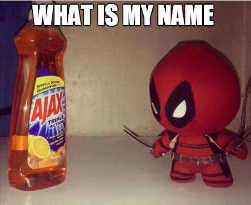

<!-- {"layout": "title"} -->
# **JavaScript** parte 7
## Ajax

---
<!-- {"layout": "centered"} -->
# Hoje veremos

1. [Requisições síncronas](#como-funcionam-as-requisições)
1. [Ajax](#requisições-assíncronas): requisições assíncronas
   - Em _vanilla_ JavaScript
   - Com ajuda de jQuery
   - Usando <code>fetch</code>

---
<!-- { "layout": "section-header", "hash": "requisicoes-sincronas"} -->
# Requisições Síncronas
## Como funcionam as requisições

- Revisando:
  - O modelo de requisição-resposta
  - Vendo as requisições realizadas
- Síncrono _vs_ assíncrono <!-- {ul^1:.content} -->

---
<!-- {"embedSVG": "img[src$='.svg']", "styles": ["../../styles/classes/http-diagram.min.css"], "backdrop": "oldtimes"} -->
## Relembrando, o protocolo **HTTP**

- É um **protocolo** na camada de aplicação
  > Conjunto de regras bem definidas descrevendo como
  > entidades se comunicam.
  - É a **"língua falada" pelo navegador e pelo servidor web**
- Modelo requisição &rarr; resposta

### **Navegador requisita** algo e **Servidor responde**


 <!-- {.full-width.centered.step-3} --> <!-- {ul:.http-diagram.no-bullets.no-padding.bullet} -->
  Requisição:
  ```http
  GET /index.html HTTP/1.1
  Host: www.twitter.com
  ```

1. Resposta: <!-- {ol:.bullet.no-bullets.no-padding.compact-code} -->
   ```http
   HTTP/1.1 200 OK
   Date: Mon, 23 May 2005 22:38:34 GMT
   Server: Apache/1.3.3.7 (Unix) (Red-Hat/Linux)
   Content-Type: text/html; charset=UTF-8
   Content-Length: 131

   <!DOCTYPE html>
   <html>
   <head>
     <title>Twitter</title>
   </head>
   <body>
     Olá mundo, este é um tweet.
   </body>
   </html>
   ```

---
<!-- {"layout": "2-column-content"} -->
## Síncrono _vs_ assíncrono

- Uma **requisição tradicional é síncrona**, ou seja, enquanto ela está sendo
  feita, o navegador "deixa o usuário esperando"
- Uma **requisição assíncrona** é disparada e "esquecida". Quando sua
  resposta chega, uma função JavaScript é chamada
  - O usuário pode **continuar usando a página** enquanto a resposta chega


 <!-- {.bullet.figure-step.bullet-no-anim.full-width} -->
 <!-- {.bullet.figure-step.bullet-no-anim.full-width} -->
 <!-- {.bullet.figure-step.bullet-no-anim.full-width} -->
 <!-- {.bullet.figure-step.bullet-no-anim.full-width} -->
 <!-- {.bullet.figure-step.bullet-no-anim.full-width} -->
 <!-- {.bullet.figure-step.bullet-no-anim.full-width} -->
 <!-- {.bullet.figure-step.bullet-no-anim.full-width} -->
 <!-- {.bullet.figure-step.bullet-no-anim.full-width} -->
 <!-- {.bullet.figure-step.bullet-no-anim.full-width} -->
 <!-- {.bullet.figure-step.bullet-no-anim.full-width} -->


---
<!-- {"fullPageElement": "#ajax-video", "playMediaOnActivation": {"selector": "#ajax-video" }} -->
<video src="//willsallum.github.io/cefet_front_end_large_assets/videos/ajax-no-fumaceiro.webm" controls id="ajax-video"></video>

[:globe_with_meridians: Exemplo do Fumaceiro][fumaceiro] <!-- {a:.full-page-video-caption target="_blank"} -->

[fumaceiro]: https://willsallum.github.io/cefet_front_end_ajax

---
<!-- {"layout": "section-header", "hash": "ajax"} -->
# Ajax
## Requisições **assíncronas**

 <!-- {.medium-width.centered.block} -->

1. Exemplo antigão (`XMLHttpRequest`)
1. Exemplo com jQuery
1. Exemplo com fetch  <!-- {.on-line.bouncing-left} -->

<!-- {ol:.content} -->

---
## Ajax

- É a sigla para _Asynchronous JavaScript and XML_ <!-- {ul:.bullet} -->
  - Um nome melhor seria **requisição assíncrona**
- Surgiu no Internet Explorer, nos anos 2000,
  por [Jesse Gareth][ajax-article]
- Originalmente, usava-se JavaScript para fazer uma requisição de dados ao
  servidor, que respondia no formato XML (em vez de HTML)
- Hoje em dia, **responde-se com** qualquer objeto reconhecido pelo navegador
  (o mais comum é **JSON**)
- Podemos ver as requisições Ajax (XHR) da página: <!-- {li:.bullet} -->
   <!-- {.centered} -->

[ajax-article]: http://www.adaptivepath.org/ideas/ajax-new-approach-web-applications/
*[Ajax]: Asynchronous JavaScript and XML*
*[XML]: eXtensible Markup Language*
*[XHR]: XMLHttpRequest*

---
<!-- {"hash": "ajax-vanilla-1"} -->
## (1) O **`XMLHttpRequest`** <small>(antigão)</small>

- Cada requisição Ajax é um objeto `XMLHttpRequest`. Exemplo do Twitter:
  ```js
  let requisicao = new XMLHttpRequest();
  requisicao.onreadystatechange = callbackMaisTweets;
  requisicao.responseType = 'json';
  requisicao.open('GET', '/tweets/pagina/5');
  requisicao.send();
  ```
- Uma _callback_ (definida em `onreadystatechange`) é invocada a cada **mudança
  de estado** da requisição (veja nos próximos 2 slides)
- [Referência](https://developer.mozilla.org/pt-BR/docs/Web/API/XMLHttpRequest) e [Tutorial](https://developer.mozilla.org/pt-BR/docs/Web/API/XMLHttpRequest/Usando_XMLHttpRequest) na MDN

---
<!-- {"layout": "centered-horizontal", "hash": "ajax-vanilla-2"} -->
```js
function callbackMaisTweets() {
  if (requisicao.readyState === 4) {  // 4: DONE (resp. recebida)
    if (requisicao.status === 200) {  // 200: código Ok do HTTP
      // a resposta chegou e foi um arquivo
      // .json com um array de tweets:
      let novosTweets = requisicao.response.arrayComNovosTweets;
      novosTweets.forEach(colocaTweetNaPagina);
    } else {
      console.log('Erro ao carregar mais tweets. Código HTTP: '
        + requisicao.status);
    }
  }
}
```
- Invocada **a cada alteração** de estado
  - da requisição `XMLHttpRequest`

---
<!-- {"layout": "centered", "state":"show-active-slide-and-previous", "containerStyles": {"--show-2-slides-x-distance": "310px", "--show-2-slides-z-distance": "-400px", "--show-2-slides-rotation": "10deg "}} -->

- A resposta foi isto:
```json
{
  "quantidade": 20,
  "arrayComNovosTweets": [
    {
      "autor": "Sensacionalista",
      "texto": "Grupo de pessoas que sabem tudo
                cria novo grupo: Vegetarianos
                pró carne mal passada",
      "curtidas": 2
    } /* mais 19 tweets aqui... */
  ]
}
```

---
## Estados de um `XMLHttpRequest`

**0	`UNSENT`**
  .. `open()` ainda não foi invocado

**1	`OPENED`**
  .. `send()` ainda não foi invocado

**2	`HEADERS_RECEIVED`**
  .. `send()` foi invocado e os cabeçalhos da resposta
  já estão disponíveis (chegaram)

**3	`LOADING`**
  .. fazendo _download_ da resposta

**4	`DONE`**
  .. operação finalizada

- Basicamente, precisamos de fazer algo apenas quando a requisição chega
  ao estado **4 `DONE`**

---
<!-- {"layout": "2-column-content"} -->
## Exemplo do Fumaceiro <small>(versão [_vanilla js_][fumaceiro])</small>

 <!-- {.bordered.rounded style="max-width: 100%; box-shadow: 3px 3px 3px silver"} -->

- Uma página de um jogo com **informações + avaliações**
- Como nem todos usuários lêem avaliações, elas não são carregadas inicialmente
  - Isso foi feito para **carregar a página mais rápido**
- Ao clicar no botão "Mostrar avaliações", fazemos uma **requisição Ajax
  para pegá-las** e, então, as mostramos

[fumaceiro]: https://willsallum.github.io/cefet_front_end_ajax/

---
<!-- {"classes": "compact-code"} -->
```js
// no clique, faz um Ajax para pegar o xcom-reviews.json
showReviewsEl.addEventListener('click', () => {
  let requisicao = new XMLHttpRequest();
  requisicao.open('GET', 'xcom-reviews.json');
  requisicao.responseType = 'json';
  requisicao.onreadystatechange = () => {
    // chegando a resposta, põe as avaliações na página
    if (requisicao.readyState === 4) {
      if (requisicao.status === 200) {
        // a resposta é um objeto js que tem 'avaliacoes'
        let avaliacoes = requisicao.response.avaliacoes;

        reviewsEl.innerHTML = '';
        avaliacoes.forEach(criaAvaliacaoNaPagina);
      }
    }
  }

  requisicao.send();
});
```

---
<!-- {"state": "show-active-slide-and-previous"} -->
```json
{
  "avaliacoes": [
    {
      "autor": "Astolfo Lombardi",
      "recomenda": true,
      "comentario": "Um jogo de ETs sinistrões",
      "curtidas": 18
    },
    {
      "autor": "Eymael Fortunato",
      "recomenda": true,
      "comentario": "Rola uma parada sadia entre
                     humanos e aliens neste jogo #sqn",
      "curtidas": 7
    } /* ...+2 avaliações */
  ]
}
```

---
<!-- {"hash": "ajax-jquery"} -->
## (2) Ajax mais facinho **com jQuery**

- O jQuery possui uma abstração do objeto `XMLHttpRequest` para facilitar a
  realização de requisições Ajax. Exemplo:
    ```js
    $.ajax({
      url: '/tweets/pagina/5',
      dataType: 'json',
      success: function(resposta) {
        let novosTweets = resposta.arrayComNovosTweets;
        novosTweets.forEach(colocaTweetNaPagina);
      }
    });
    ```
  - Existe [`$.getJSON({...})`][jquery-getjson], equivalente a
    [`$.ajax({...})`][jquery-ajax] com o `dataType: 'json'`

[jquery-getjson]: http://api.jquery.com/jQuery.getJSON/#jQuery-getJSON-url-data-success
[jquery-ajax]: http://api.jquery.com/jquery.ajax/#jQuery-ajax-url-settings

---
## Exemplo do Fumaceiro <small>(versão [jQuery][fumaceiro-jquery])</small>

```js
$('#show-reviews').click(() => {
  $.ajax({
    url: 'xcom-reviews.json',
    dataType: 'json',
    success: resposta => {
      // a resposta é um objeto js que contém uma propriedade avaliacoes
      let avaliacoes = resposta.avaliacoes;
      // limpamos a <div id="reviews">...</div>
      $reviews.empty();
      // percorremos as avaliacoes, colocando elementos na página
      avaliacoes.forEach(criaAvaliacaoNaPagina);
    }
  });
});
```

[fumaceiro-jquery]: https://willsallum.github.io/cefet_front_end_ajax/index-jquery.html

---
<!-- {"hash": "ajax-fetch"} -->
## (3) Ajax usando **fetch**  <!-- {.on-line.bouncing-left} -->

- Mais recentemente, foi introduzida nova forma: `fetch(...)` <!-- {ul:.full-width} -->
- Ele envia uma requisição Ajax e retorna uma **Promessa**
  > **Promessa**: algo que pode dar certo, ou errado.
  > <cite>Coutinho</cite>
- Formato:
  ```js
  fetch(url, opcoes)
    .then(callbackSucesso)
    .catch(callbackErro);
  ```
- Referência do [Fetch na MDN][fetch-mdn]

[fetch-mdn]: https://developer.mozilla.org/en-US/docs/Web/API/Fetch_API/Using_Fetch

---
## Exemplo do Fumaceiro <small>(versão [fetch][fumaceiro-fetch])</small>

```js
showReviewsEl.addEventListener('click', () => {
  fetch('xcom-reviews.json')                        // retorna uma *promessa*
    .then(respostaBruta => respostaBruta.json())    // arrow function
    .then(resposta => {
      // a resposta é um objeto js que contém uma propriedade avaliacoes
      let avaliacoes = resposta.avaliacoes;

      reviewsEl.innerHTML = '';
      avaliacoes.forEach(criaAvaliacaoNaPagina);      
    });
  });
});
```

[fumaceiro-fetch]: https://willsallum.github.io/cefet_front_end_ajax/index-fetch.html

---

## Usos comuns de Ajax

- Pegar novas informações depois que a página carregou. Exemplos:
  - Carregar mais _tweets_
  - Carregar mais produtos
  - Carregar avaliações, comentários
  - Carregar a próxima fase de um jogo
- Avisar ao _back-end_ que algo mudou, sem sair da página. Exemplos:
  - Botão curtir
  - Enviar um comentário
  - Adicionar produto ao carrinho
- Pegar informações **de outros sites** (se eles permitirem)
  - Basta usar uma URL absoluta, por exemplo, colocando
    [`https://swapi.dev/api/films/1/`][swapi-example] como a URL

[swapi-example]: https://swapi.dev/api/films/1/

---

<!-- {"layout": "centered"} -->
# Referências

1. Mozilla Developer Network (MDN)
1. [Artigo que batizou a técnica de Ajax][artigo-ajax], de Jesse James Garret

[artigo-ajax]: http://adaptivepath.org/ideas/ajax-new-approach-web-applications/

---
<!-- {"hash": "setup-local-server"} -->
## Erro ao fazer o AJAX (slide oculto :P)

- Os navegadores têm uma política de permissões diferente para quando
  acessamos uma página via o protocolo file:// que proíbe o uso de
  requisições Ajax, dentre outras coisas
- Para contornar a restrição, precisamos hospedar nosso arquivo em um servidor
  Web e acessar a página usando o protocolo HTTP
  1. Navegue até seu diretório com o arquivo index.html **pelo terminal**
  1. Use um servidor http simples em python
     ```bash
     $ python -m SimpleHTTPServer
     ```
  1. Acesse http://localhost:8000 no navegador
